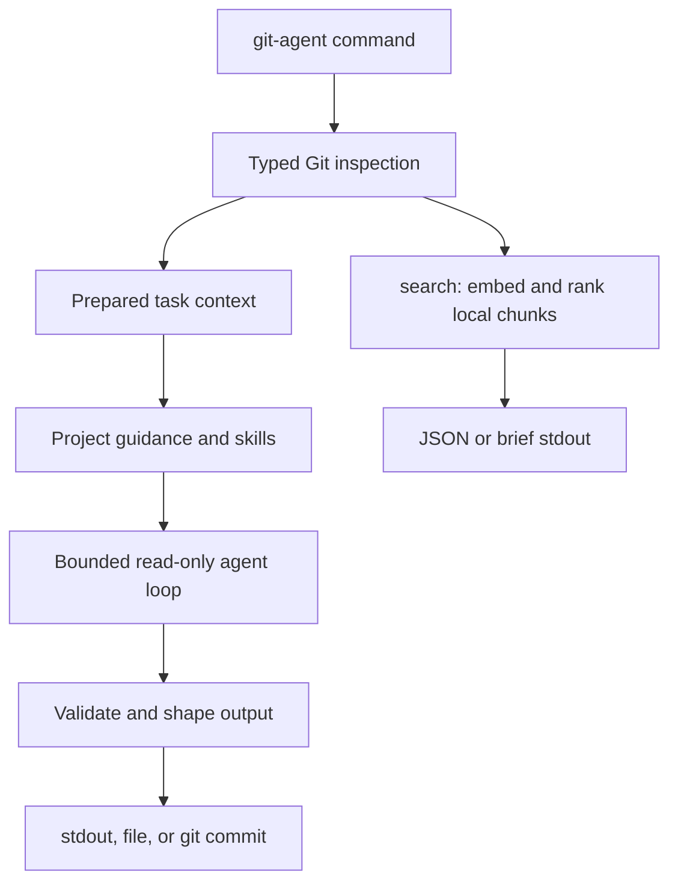

# git-agent

Commit, PR, release, review, simplification, and repository-search context for
AI-assisted Git work.

`git-agent` gathers Git evidence with typed Go code, runs a bounded
OpenAI-compatible tool-calling loop, and keeps model tools read-only. The
`commit` command is the only workflow that writes to Git, and it does that after
message generation by handing the final message to `git commit`.

TL;DR: use `commit-msg` when you want a grounded commit message on stdout, use
`commit` when you want the same message created as a Git commit, use
`release-note` for release Markdown, and use `search` when an agent needs fast
local implementation context. Use `review` for evidence-backed defects and
`simplify` for behavior-preserving cleanup opportunities.

## Quick Start

```sh
# 1. Install the binary
go install github.com/yusing/git-agent/cmd/git-agent@latest

# 2. Generate a commit message from staged changes
git-agent commit-msg

# 3. Or generate and create the commit
git-agent commit
```

By default, message-generation commands use ChatGPT/Codex auth from
`~/.codex/auth.json`. `OPENAI_API_KEY` is the fallback for OpenAI-compatible
provider auth when that file is absent.

`go install` writes to `$(go env GOPATH)/bin` by default; make sure that
directory is on `PATH`.

## Everyday Workflows

<!-- markdownlint-disable MD013 -->

| Workflow | Command | Output |
| --- | --- | --- |
| Staged commit message | `git-agent commit-msg` | Final commit message on stdout |
| Amend commit message | `git-agent commit-msg --amend` | Final amended commit message on stdout |
| Generate and commit | `git-agent commit` | Human trace, then Git commit output |
| Generate and amend | `git-agent commit --amend` | Human trace, then Git amend output |
| Squash PR message | `git-agent pr-message` | Squash merge message on stdout |
| Release body | `git-agent release-note <base> <release>` | Release Markdown on stdout |
| Version bump release body | `git-agent release-note patch` | Release Markdown for latest tag to `HEAD` |
| Uncommitted review | `git-agent review` | Structured JSON findings plus agent-event URL |
| Staged review | `git-agent review --staged` | Structured JSON findings for index changes only |
| Codebase simplification audit | `git-agent simplify --codebase` | Structured JSON simplification opportunities |
| Agent context search | `git-agent search --agent <query...>` | Brief results, plus progress URL when indexing |
| Configure index sync | `git-agent config index.remote <git-url>` | Save a dedicated Git remote for shared revision indexes |
| Push local indexes | `git-agent index sync` | Additively publish all completed local revision indexes |
| List search indexes | `git-agent search --ls` | Local index summaries for the current project |
| List indexed files | `git-agent search --ls-files` | Tree of files stored in the selected index |

<!-- markdownlint-enable MD013 -->

## Why git-agent?

LLMs are useful for Git writing, but raw prompts miss repository facts easily:
staged scope, amend intent, recent message style, generated-heavy diffs,
submodule history, guidance files, release ranges, and stdout/stderr contracts.

`git-agent` front-loads those facts before the model writes:

1. It inspects the repository with typed Git plumbing.
2. It builds task-specific evidence for commit, PR, release, or search work.
3. It exposes only narrow read-only tools when the model needs more context.
4. It validates and shapes final output for the requested workflow.

For submodule-only staged updates, normal `commit-msg` and `commit` skip the LLM
entirely and format a deterministic local message.

## What It Provides

<!-- markdownlint-disable MD013 -->

| Surface | What it does |
| --- | --- |
| Prepared Git context | Staged paths, status, stats, diffs, amend base, branch diffs, release ranges, and recent style commits |
| Read-only model tools | Bounded file, diff, and repository inspection tools for generation workflows |
| Guidance discovery | AGENTS/CLAUDE-family project instructions, plus local Codex-style `SKILL.md` workflow guidance |
| Commit execution | Optional explicit `git commit --file -` or `git commit --amend --file -` after message generation |
| Release-note writing | Release Markdown from explicit refs or `patch`, `minor`, and `major` shortcuts |
| Review and simplification | Strict JSON reports with repository evidence and replayable SSE agent events |
| Embedding search | Local filesystem or committed-tree context search for agents and humans |
| Trace artifacts | JSON request/response/tool-call traces for message generation commands |
| Debug output | Human console diagnostics with `--debug`; pprof with `--pprof <addr>` |

<!-- markdownlint-enable MD013 -->

## Review and Simplify

`review` and `simplify` are read-only Responses API workflows designed for LLM
harnesses. Both default to all dirty changes, regardless of staging state.

```sh
# Review staged and unstaged work together
git-agent review

# Review only the Git index
git-agent review --staged

# Audit the full repository
git-agent review --codebase

# Find behavior-preserving cleanup opportunities in dirty changes
git-agent simplify

# Add lower-priority task focus after flags
git-agent review --staged focus on cancellation and cleanup
```

Exactly one mode may be selected: `--codebase`, `--uncommitted`, or `--staged`.
No mode means `--uncommitted`. Both commands write strict, evidence-located JSON
reports to stdout. They have no request deadline by default; `--timeout
<duration>` adds one explicitly. Without `--model` or `OPENAI_MODEL`, `review`
uses `gpt-5.6-sol` and `simplify` uses `gpt-5.6-terra`; both use
provider-default reasoning effort unless an effort flag is supplied.

Before the first provider request, each command prints an ephemeral event URL
to stderr. Its replayable stream includes live reasoning-summary progress:

```text
review: agent events listening on http://127.0.0.1:43127/events?token=4YH2S7M6N5QK8J3C9RTP
```

See [docs/spec.md](docs/spec.md) for exact mode, schema, tool, and SSE contracts.

## Search

`git-agent search` is embedding-backed implementation-location search. It does
not run the Responses API or create message-generation sessions.

```sh
# Search current filesystem files; Git repositories share a root index
git-agent search "where is release note evidence prepared"

# Compact output for humans
git-agent search --format brief "where are search flags parsed"

# Agent mode: compact output plus progress probe when indexing
git-agent search --agent "where are search flags parsed"

# Search code only, excluding common tests
git-agent search --code --no-tests "commit amend validation"

# Index first, without running a query
git-agent search --index

# Search a committed tree instead of the working filesystem
git-agent search --rev HEAD~1 "guidance discovery"

# Search a cached remote repository
git-agent search --remote https://github.com/yusing/git-agent.git "search flags"

# List search indexes for this project
git-agent search --ls

# List cached remote repositories
git-agent search --ls-remotes

# List indexed files as a tree
git-agent search --ls-files
```

Search reads `OPENAI_EMBEDDING_API_KEY` first, then falls back to
`OPENAI_API_KEY`. Codex/ChatGPT auth is not used for embeddings. Use
`OPENAI_EMBEDDING_BASE_URL`, `OPENAI_EMBEDDING_MODEL`, and
`OPENAI_EMBEDDING_DIMENSIONS` to isolate search embedding config from normal
message-generation config.

Search indexes can be synchronized through a dedicated Git repository:

```sh
git-agent config index.remote git@example.com:team/git-agent-indexes.git
git-agent config index.remote
git-agent index sync
git-agent config --unset index.remote
```

Normal search syncs selected revision: committed `HEAD` for filesystem search,
resolved `--rev`, or selected `--remote` revision. Working-tree-only vectors
remain local. `git-agent index sync` additively publishes every completed local
revision index without embedding new content. Index repository must be
dedicated to `git-agent`; unreachable remote fails explicitly. Sync progress is
reported on stderr in terminals and redirected output, including bracketed
fetch/push object-transfer progress, while final summary remains on stdout. See
[docs/spec.md](docs/spec.md) for exact sync contracts.

Generated index-store commits are always unsigned. This is enforced only in
the dedicated local index-sync repository and does not change signing settings
for source repositories or `search --remote` caches.

SSH remotes try available agent identities first, then unencrypted default
keys in `~/.ssh/id_ed25519`, `id_ecdsa`, `id_rsa`, and `id_dsa`. Encrypted keys
require an agent because git-agent never prompts. Hosts must exist in
`~/.ssh/known_hosts`.

Normal indexing reuses exact matching chunk embeddings from compatible indexes
for the same project or cached remote. This includes filesystem-to-revision and
revision-to-revision reuse, so searching a nearby commit usually embeds only its
changed chunks. Compatible indexes also reference one shared on-disk vector
payload per project or remote cache instead of copying unchanged vectors into
every snapshot. Existing local vector payloads migrate on a later cache write.
`--reindex` skips cross-index reuse, rebuilds the selected source, and appends a
new shared vector generation without changing older snapshots. Interrupted
cache writes remain incomplete and rebuild on the next search instead of being
used as completed indexes.

Useful flags:

<!-- markdownlint-disable MD013 -->

| Flag | Purpose |
| --- | --- |
| `--scope <paths>` | Limit search or indexing; local paths are current-directory-relative, remote paths are repository-relative |
| `--rev <rev>` | Search a committed Git tree |
| `--remote <url>` | Search a cached remote Git repository URL |
| `--code` | Include source-code files only |
| `--no-tests` | Exclude common cross-language test filenames and test directories from results and `--ls-files` output |
| `--min-relatedness <n>` | Set vector relatedness candidate threshold |
| `--limit <n>` | Limit result count |
| `--format` | Use `json\|brief` for search, `text\|json` for `--ls`, `text\|json\|completion` for `--ls-remotes`, and `tree\|json` for `--ls-files` |
| `--index` | Build missing embeddings without searching |
| `--reindex` | Rebuild existing embeddings and drop stale cache entries |
| `--agent` | Use agent-friendly brief output and serve remote-fetch details and indexing progress on localhost when work is needed |
| `--ls` | List search indexes for the current project or `--remote` cache without embedding or querying |
| `--ls-remotes` | List cached remote repositories without embedding, fetching, or querying |
| `--ls-files` | List files in the selected search index without embedding or querying; `--no-tests` filters listed paths without changing the selected index |

<!-- markdownlint-enable MD013 -->

Index inspection commands:

```sh
git-agent search --ls
git-agent search --ls --format json
git-agent search --ls-remotes
git-agent search --ls-remotes --format json
git-agent search --ls-remotes --format completion
git-agent search --ls-files
git-agent search --ls-files --format json
git-agent search --ls-files --no-tests
git-agent search --ls-files --rev HEAD --scope internal/
git-agent search --ls-files --remote https://github.com/yusing/git-agent.git
```

Remote `--ls` output shows the cached bare-repository path even when no completed
search indexes exist, followed by each available index path.

Use [docs/spec.md](docs/spec.md) for exact cache layout and index-selection
contracts.

See `git-agent search --help` and [docs/spec.md](docs/spec.md) for exact
output, cache, ignore-file, and debug behavior.

## CLI Reference

Everyday commands:

```sh
git-agent commit-msg [--amend] [flags]
git-agent commit [--amend] [flags]
git-agent pr-message [flags]
git-agent release-note [--out <file>] [flags] <base> <release>
git-agent release-note [--out <file>] [flags] patch|minor|major
git-agent review [--codebase|--uncommitted|--staged] [flags] [prompt...]
git-agent search [flags] <query...>
git-agent search --ls [--remote <url>] [--format text|json]
git-agent search --ls-remotes [--format text|json|completion]
git-agent search --ls-files [--format tree|json] [--remote <url>] [--rev <rev>] [--scope <paths>] [--no-tests]
git-agent simplify [--codebase|--uncommitted|--staged] [flags] [prompt...]
git-agent config index.remote [<git-url>]
git-agent config --unset index.remote
git-agent index sync
```

Common generation and inspection flags:

<!-- markdownlint-disable MD013 -->

| Flag | Purpose |
| --- | --- |
| `--model <name>` | Override command default and `OPENAI_MODEL` |
| `--fast` | Request fast service tier |
| `--low`, `--medium`, `--high`, `--xhigh` | Set reasoning effort |
| `--base-url <url>` | Override provider base URL |
| `--timeout <duration>` | Set request timeout; `review`/`simplify` default to none |
| `--max-steps <n>` | Bound agent loop steps |
| `--guidance-family auto\|agents\|claude\|codex\|none` | Force guidance family |
| `--append-prompt <text>` | Add a bounded operator hint |
| `--debug` | Print diagnostics and trace location |
| `--pprof <addr>` | Serve Go pprof endpoints |

<!-- markdownlint-enable MD013 -->

`release-note --out <file>` writes the rendered Markdown to the file, streams a
human console trace to stdout, and skips the on-disk JSON trace session.

## Configuration

Persistent settings are stored in
`${XDG_CONFIG_HOME:-~/.config}/git-agent/config.json`. `index.remote` is
global. Displayed URLs redact URL credentials; sync uses same Git transport
and authentication behavior as search `--remote`, without invoking `git`
executable or interactive credential prompts.

Default auth comes from:

```text
~/.codex/auth.json
```

The file must include ChatGPT auth:

```json
{
  "auth_mode": "chatgpt",
  "tokens": {
    "access_token": "...",
    "account_id": "..."
  }
}
```

ChatGPT auth sends requests to `https://chatgpt.com/backend-api/codex` with
`Authorization: Bearer <access_token>` and
`ChatGPT-Account-ID: <account_id>`. Requests also identify the Codex client by
sending `originator: codex_cli_rs` and `User-Agent: codex_cli_rs`.

When `~/.codex/auth.json` is absent, `OPENAI_API_KEY` is used as a legacy
OpenAI-compatible fallback. `OPENAI_BASE_URL` only applies to that fallback path
unless `--base-url` is passed explicitly.

Supported environment variables:

<!-- markdownlint-disable MD013 -->

| Variable | Used for |
| --- | --- |
| `OPENAI_API_KEY` | Message-generation fallback auth and search fallback auth |
| `OPENAI_BASE_URL` | Message-generation fallback base URL and search fallback base URL |
| `OPENAI_MODEL` | Message-generation model; defaults to `gpt-5.6-luna` |
| `OPENAI_EMBEDDING_API_KEY` | Search embedding auth |
| `OPENAI_EMBEDDING_BASE_URL` | Search embedding base URL |
| `OPENAI_EMBEDDING_MODEL` | Search embedding model |
| `OPENAI_EMBEDDING_DIMENSIONS` | Search embedding dimensions |
| `OPENAI_EMBEDDING_MAX_INPUT_CHARS` | Search per-input character cap |
| `OPENAI_EMBEDDING_BATCH_INPUTS` | Search embedding request input count |
| `OPENAI_EMBEDDING_BATCH_MAX_CHARS` | Search embedding request character budget |
| `OPENAI_EMBEDDING_CONCURRENCY` | Search embedding request concurrency |

<!-- markdownlint-enable MD013 -->

CLI flags override environment values.

With ChatGPT auth, the `gpt-5.6` alias resolves to `gpt-5.6-sol`. The canonical
`gpt-5.6-sol`, `gpt-5.6-terra`, and `gpt-5.6-luna` identifiers pass through
unchanged.

Behavior defaults:

- `service_tier` is omitted unless `--fast` is set.
- Reasoning effort is omitted unless `--low`, `--medium`, `--high`, or
  `--xhigh` is set.
- `--append-prompt` can steer style or emphasis only when consistent with the
  task contract and repository evidence.

## How It Works



Message-generation commands write JSON traces under:

```text
~/.git-agent/<path-sha>/sessions/<timestamp>-<command>/
```

Trace files include session metadata, provider requests/responses, tool calls,
and returned tool output. API keys are redacted. `--debug` prints the trace
directory to stderr.

`review` and `simplify` stream those events from memory over SSE and do not
create on-disk trace sessions.

Search indexes use the same project metadata root:

```text
~/.git-agent/<path-sha>/search/
```

On the next run for an existing project, legacy metadata from
`<project>/.git-agent/` is migrated into the home metadata directory
automatically.

## Local Development

```sh
make build
make test
make install PREFIX=/usr/local
```

`make install` installs the locally built binary and honors `DESTDIR` for
package-style installs.

Fish completion install defaults:

| Variable | Default |
| --- | --- |
| `XDG_CONFIG_HOME` | `$(HOME)/.config` |
| `FISH_CONFIG_DIR` | `$(XDG_CONFIG_HOME)/fish` |
| `FISH_COMPLETIONS_DIR` | `$(FISH_CONFIG_DIR)/completions` |

## Security and Privacy

- Model tools are read-only and bounded.
- No arbitrary shell command tool is exposed to the model.
- `commit` and `commit --amend` are explicit Git write commands, run only after
  message generation.
- Normal Git config, hooks, signing, and `gpg-agent` behavior apply when
  creating commits.
- Message generation sends prepared repository context to the configured
  provider.
- Search sends indexed chunks and queries to the configured embedding provider.
- API keys and bearer tokens are redacted from traces, debug output, and errors.
- Repository tools do not follow symlinks outside the repository.
- Metadata, indexes, and trace artifacts under `~/.git-agent/` are restricted to
  the current user on platforms with Unix-style permission bits.

## Specification

[docs/spec.md](docs/spec.md) is the normative behavior contract for commands,
flags, stdout/stderr, tracing, search indexing, guidance discovery, and model
tool limits. Keep README changes user-facing; update the spec when behavior or
contracts change.
