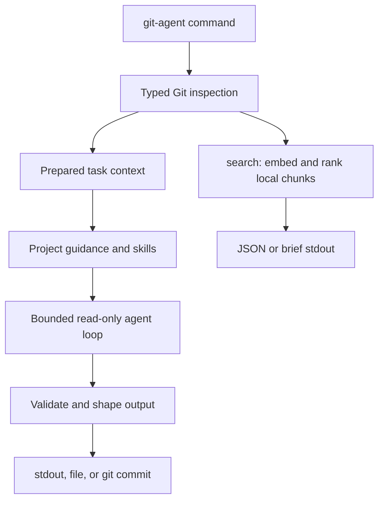

# git-agent

Commit, PR, release, review, simplification, and repository-search context for
AI-assisted Git work.

`git-agent` gathers Git evidence with typed Go code, runs a bounded
OpenAI-compatible tool-calling loop, and keeps model tools read-only. The
`commit` command is the only workflow that writes to Git, and it does that after
message generation by handing the final message to `git commit`.

TL;DR: use `commit-msg` when you want a grounded commit message on stdout, use
`commit` when you want the same message created as a Git commit, use
`release-note` for release Markdown, and use `search` when an agent needs fast
local implementation context. Use `review` for evidence-backed defects and
`simplify` for behavior-preserving cleanup opportunities.

## Quick Start

```sh
# 1. Install the binary
go install github.com/yusing/git-agent/cmd/git-agent@latest

# 2. Generate a commit message from staged changes
git-agent commit-msg

# 3. Or generate and create the commit
git-agent commit
```

By default, message-generation commands use ChatGPT/Codex auth from
`~/.codex/auth.json`. `OPENAI_API_KEY` is the fallback for OpenAI-compatible
provider auth when that file is absent.

`go install` writes to `$(go env GOPATH)/bin` by default; make sure that
directory is on `PATH`.

## Everyday Workflows

<!-- markdownlint-disable MD013 -->

| Workflow | Command | Output |
| --- | --- | --- |
| Staged commit message | `git-agent commit-msg` | Final commit message on stdout |
| Amend commit message | `git-agent commit-msg --amend` | Final amended commit message on stdout |
| Generate and commit | `git-agent commit` | Human trace, then Git commit output |
| Generate and amend | `git-agent commit --amend` | Human trace, then Git amend output |
| Squash PR message | `git-agent pr-message` | Squash merge message on stdout |
| Release body | `git-agent release-note <base> <release>` | Release Markdown on stdout |
| Version bump release body | `git-agent release-note patch` | Release Markdown for latest tag to `HEAD` |
| Uncommitted review | `git-agent review` | Detached task launch JSON |
| Staged review | `git-agent review --staged` | Detached staged-review launch JSON |
| Codebase simplification audit | `git-agent simplify --codebase` | Detached codebase-audit launch JSON |
| Agent context search | `git-agent search --agent <query...>` | Brief results, plus progress endpoint when indexing |
| Configure index sync | `git-agent config index.remote <git-url>` | Save a dedicated Git remote for shared revision indexes |
| Push local indexes | `git-agent index sync` | Additively publish all completed local revision indexes |
| List search indexes | `git-agent search --ls` | Local index summaries for the current project |
| List indexed files | `git-agent search --ls-files` | Tree of files stored in the selected index |

<!-- markdownlint-enable MD013 -->

## Why git-agent?

LLMs are useful for Git writing, but raw prompts miss repository facts easily:
staged scope, amend intent, recent message style, generated-heavy diffs,
submodule history, guidance files, release ranges, and stdout/stderr contracts.

`git-agent` front-loads those facts before the model writes:

1. It inspects the repository with typed Git plumbing.
2. It builds task-specific evidence for commit, PR, release, or search work.
3. It exposes only narrow read-only tools when the model needs more context.
4. It validates and shapes final output for the requested workflow.

For submodule-only staged updates, normal `commit-msg` and `commit` skip the LLM
entirely and format a deterministic local message.

## What It Provides

<!-- markdownlint-disable MD013 -->

| Surface | What it does |
| --- | --- |
| Prepared Git context | Staged paths, status, stats, diffs, amend base, branch diffs, release ranges, and recent style commits |
| Read-only model tools | Bounded file, diff, and repository inspection tools for generation workflows |
| Guidance discovery | AGENTS/CLAUDE-family project instructions, plus local Codex-style `SKILL.md` workflow guidance |
| Commit execution | Optional explicit `git commit --file -` or `git commit --amend --file -` after message generation |
| Release-note writing | Release Markdown from explicit refs or `patch`, `minor`, and `major` shortcuts |
| Review and simplification | Strict JSON reports with repository evidence and replayable SSE agent events |
| Embedding search | Local filesystem or committed-tree context search for agents and humans |
| Debug output | Human console diagnostics with `--debug`; pprof with `--pprof <addr>` |

<!-- markdownlint-enable MD013 -->

## Review and Simplify

`review` and `simplify` are read-only Responses API workflows designed for LLM
harnesses. Both default to all dirty changes, regardless of staging state.

```sh
# Review staged and unstaged work together
git-agent review
# {"command":"review","id":"...","pid":12345,"endpoint":{"network":"unix","address":"/tmp/.../http.sock","url":"http://localhost/events?token=..."}}
git-agent review --wait <id-from-launch-json>

# Review only the Git index
git-agent review --staged

# Audit the full repository
git-agent review --codebase

# Find behavior-preserving cleanup opportunities in dirty changes
git-agent simplify
git-agent simplify --wait <id-from-launch-json>

# Allow an orchestrator-owned manifest to expose immutable external evidence
git-agent review --orchestration-artifact /absolute/run/manifest.json

# Add lower-priority task focus after flags
git-agent review --staged focus on cancellation and cleanup

# Exercise launch, events, rendering, and wait without provider access
git-agent review --dry-run
```

Exactly one mode may be selected: `--codebase`, `--uncommitted`, or `--staged`.
No mode means `--uncommitted`. Both commands always launch detached and write
one strict launch JSON object to stdout. It contains `command`, durable task
`id`, producer `pid`, and authenticated event `url`. Successful launch writes
nothing to stderr. Matching `--wait <id>` forms write strict, evidence-located
JSON reports to stdout. They have no request deadline by default; `--timeout
<duration>` adds one explicitly. Without `--model` or `OPENAI_MODEL`, `review`
uses `gpt-5.6-sol` and `simplify` uses `gpt-5.6-terra`; both use provider-default
reasoning effort unless an effort flag is supplied.

Diff-based review and simplification preload a bounded current-change context
and, when available, a previous-`HEAD` context pack for contrast. Current dirty
or staged changes remain authoritative. Simplification also checks explicitly
for behavior-preserving removal of overengineering such as unnecessary
abstractions, premature generalization, needless indirection or configuration,
redundant state or concurrency, and disproportionate architecture.

`--orchestration-artifact <absolute-path>` enables helper-authorized evidence
for review or simplify. Manifest and declared files must be owner-only regular
files beneath manifest directory and match recorded size and SHA-256. Model can
read only declared IDs through `read_orchestration_artifact`; repository
`read_file` remains repository-confined. Final report adds trusted
`orchestration_manifest_sha256`.

Diff-mode prompts include a bounded context-pack view and bounded unified diff.
Moved submodule pointers include locally available commit summaries without
recursing into dirty submodule files. Full changed-path scope remains available
to validation and read-only repository tools without duplicating every path,
status, and stat in the initial request.
The model can page through that complete inventory before requesting narrow
path-specific diffs, and inspect bounded file outlines before selecting
`read_file` ranges.
Requests whose initial serialized estimate reaches the configured context budget
fail before contacting the provider.

Both commands offer provider-hosted web search on every normal model step using
the existing OpenAI API-key or ChatGPT/Codex-plan login. API-key auth caps hosted
searches at four per response by default; plan auth leaves provider default
uncapped. `--max-web-searches <n>` overrides either default. No search-specific
credential is needed. A provider that rejects hosted search is retried once
without it, and report summary discloses lookup limitation. Wire behavior follows
the [OpenAI web-search guide](https://developers.openai.com/api/docs/guides/tools-web-search).

Installed `go`, `rustup`, and `ctx7` executables add typed `go_doc`, `rust_doc`,
`context7_library`, and `context7_docs` tools. Missing commands are simply
omitted. These tools run fixed documentation-only argument shapes without shell
access or auto-installation. Context7 works logged out at lower service limits,
as described by its [CLI documentation](https://github.com/upstash/context7/blob/master/docs/clients/cli.mdx).
External queries must contain only public language/library questions—never
secrets, source, diffs, credentials, personal data, or private repository
details. Reports retain exact repository evidence and list deduplicated material
external source URLs or local documentation locators in summary.

The launch object's replayable local endpoint includes live reasoning-summary
progress:

```text
{"command":"review","id":"4YH2S7M6N5QK8J3C9RTPABCD","pid":12345,"endpoint":{"network":"unix","address":"/tmp/git-agent-.../http.sock","url":"http://localhost/events?token=..."}}
```

The detached review or simplification process continues serving events through
the terminal event. `review --wait <id>` or `simplify --wait <id>` waits without
a deadline and prints only the strict final report JSON. Completed reports can
be retrieved repeatedly from any working directory because task IDs are resolved
across project metadata stores. Failed, unknown, malformed, corrupt, dead-producer,
or wrong-command tasks fail with empty stdout; signals cancel an active wait.
Invalid tool arguments and missing evidence paths are returned to the model as
structured errors so it can correct the request instead of aborting the task;
an authoritative repository-state change aborts immediately. Retryable HTTP/2
stream resets and truncated provider streams receive one non-streaming retry.

See [docs/spec.md](docs/spec.md) for exact mode, schema, tool, and SSE contracts.

## codex-herdr integration

[`git-agent`](https://github.com/yusing/git-agent) works with
[`codex-herdr`](https://github.com/yusing/codex-herdr) to show live review and
simplification progress in a Herdr activity pane. From a managed root Codex
session, run:

```sh
git-agent review --uncommitted
```

The command returns launch JSON while `codex-herdr` follows the review. Its
`pid` identifies the detached process when manual termination is needed.

Git Agent does not require `codex-herdr`; both commands still work normally on
their own.

## Search

`git-agent search` is embedding-backed implementation-location search. It does
not run the Responses API.

```sh
# Search current filesystem files; Git repositories share a root index
git-agent search "where is release note evidence prepared"

# Compact output for humans
git-agent search --format brief "where are search flags parsed"

# Agent mode: compact output plus progress probe when indexing
git-agent search --agent "where are search flags parsed"

# Search code only, excluding common tests
git-agent search --code --no-tests "commit amend validation"

# Index first, without running a query
git-agent search --index

# Search a committed tree instead of the working filesystem
git-agent search --rev HEAD~1 "guidance discovery"

# Search a cached remote repository
git-agent search --remote https://github.com/yusing/git-agent.git "search flags"

# List search indexes for this project
git-agent search --ls

# List cached remote repositories
git-agent search --ls-remotes

# List indexed files as a tree
git-agent search --ls-files
```

Search reads `OPENAI_EMBEDDING_API_KEY` first, then falls back to
`OPENAI_API_KEY`. Codex/ChatGPT auth is not used for embeddings. Use
`OPENAI_EMBEDDING_BASE_URL`, `OPENAI_EMBEDDING_MODEL`, and
`OPENAI_EMBEDDING_DIMENSIONS` to isolate search embedding config from normal
message-generation config.

Search indexes can be synchronized through a dedicated Git repository:

```sh
git-agent config index.remote git@example.com:team/git-agent-indexes.git
git-agent config index.remote
git-agent index sync
git-agent config --unset index.remote
```

Normal search syncs selected revision: committed `HEAD` for filesystem search,
resolved `--rev`, or selected `--remote` revision. Working-tree-only vectors
remain local. `git-agent index sync` additively publishes every completed local
revision index without embedding new content. Index repository must be
dedicated to `git-agent`; unreachable remote fails explicitly. Sync progress is
reported on stderr in terminals and redirected output, including bracketed
fetch/push object-transfer progress, while final summary remains on stdout. See
[docs/spec.md](docs/spec.md) for exact sync contracts.

Generated index-store commits are always unsigned. This is enforced only in
the dedicated local index-sync repository and does not change signing settings
for source repositories or `search --remote` caches.

SSH remotes try available agent identities first, then unencrypted default
keys in `~/.ssh/id_ed25519`, `id_ecdsa`, `id_rsa`, and `id_dsa`. Encrypted keys
require an agent because git-agent never prompts. Hosts must exist in
`~/.ssh/known_hosts`.

Normal indexing reuses exact matching chunk embeddings from compatible indexes
for the same project or cached remote. This includes filesystem-to-revision and
revision-to-revision reuse, so searching a nearby commit usually embeds only its
changed chunks. Compatible indexes also reference one shared on-disk vector
payload per project or remote cache instead of copying unchanged vectors into
every snapshot. Existing local vector payloads migrate on a later cache write.
`--reindex` skips cross-index reuse, rebuilds the selected source, and appends a
new shared vector generation without changing older snapshots. Interrupted
cache writes remain incomplete and rebuild on the next search instead of being
used as completed indexes.

Remote indexing can overlap download and embedding, reducing first-search and
refresh time when the remote supplies selected files early enough.

Useful flags:

<!-- markdownlint-disable MD013 -->

| Flag | Purpose |
| --- | --- |
| `--scope <paths>` | Limit search or indexing; local paths are current-directory-relative, remote paths are repository-relative |
| `--rev <rev>` | Search a committed Git tree |
| `--remote <url>` | Search a cached remote Git repository URL |
| `--code` | Include source-code files only |
| `--no-tests` | Exclude common cross-language test filenames and test directories from results and `--ls-files` output |
| `--min-relatedness <n>` | Set vector relatedness candidate threshold |
| `--limit <n>` | Limit result count |
| `--format` | Use `json\|brief` for search, `text\|json` for `--ls`, `text\|json\|completion` for `--ls-remotes`, and `tree\|json` for `--ls-files` |
| `--index` | Build missing embeddings without searching |
| `--reindex` | Rebuild existing embeddings and drop stale cache entries |
| `--agent` | Use agent-friendly brief output and serve remote-fetch details and indexing progress on a private local socket when work is needed |
| `--ls` | List search indexes for the current project or `--remote` cache without embedding or querying |
| `--ls-remotes` | List cached remote repositories without embedding, fetching, or querying |
| `--ls-files` | List files in the selected search index without embedding or querying; `--no-tests` filters listed paths without changing the selected index |

<!-- markdownlint-enable MD013 -->

Index inspection commands:

```sh
git-agent search --ls
git-agent search --ls --format json
git-agent search --ls-remotes
git-agent search --ls-remotes --format json
git-agent search --ls-remotes --format completion
git-agent search --ls-files
git-agent search --ls-files --format json
git-agent search --ls-files --no-tests
git-agent search --ls-files --rev HEAD --scope internal/
git-agent search --ls-files --remote https://github.com/yusing/git-agent.git
```

Remote `--ls` output shows the cached bare-repository path even when no completed
search indexes exist, followed by each available index path.

Use [docs/spec.md](docs/spec.md) for exact cache layout and index-selection
contracts.

See `git-agent search --help` and [docs/spec.md](docs/spec.md) for exact
output, cache, ignore-file, and debug behavior.

## CLI Reference

Everyday commands:

```sh
git-agent commit-msg [--amend] [flags]
git-agent commit [--amend] [flags]
git-agent pr-message [flags]
git-agent release-note [--out <file>] [flags] <base> <release>
git-agent release-note [--out <file>] [flags] patch|minor|major
git-agent review [--codebase|--uncommitted|--staged] [flags] [prompt...]
git-agent review --wait <id>
git-agent search [flags] <query...>
git-agent search --ls [--remote <url>] [--format text|json]
git-agent search --ls-remotes [--format text|json|completion]
git-agent search --ls-files [--format tree|json] [--remote <url>] [--rev <rev>] [--scope <paths>] [--no-tests]
git-agent simplify [--codebase|--uncommitted|--staged] [flags] [prompt...]
git-agent simplify --wait <id>
git-agent config index.remote [<git-url>]
git-agent config --unset index.remote
git-agent index sync
```

Common generation and inspection flags:

<!-- markdownlint-disable MD013 -->

| Flag | Purpose |
| --- | --- |
| `--model <name>` | Override command default and `OPENAI_MODEL` |
| `--fast` | Request fast service tier |
| `--low`, `--medium`, `--high`, `--xhigh` | Set reasoning effort |
| `--base-url <url>` | Override provider base URL |
| `--timeout <duration>` | Set request timeout; `review`/`simplify` default to none |
| `--max-steps <n>` | Bound agent loop steps |
| `--max-web-searches <n>` | Review/simplify only: override hosted-search cap |
| `--orchestration-artifact <path>` | Review/simplify only: authorize immutable helper artifact manifest |
| `--dry-run` | Review/simplify only: emit deterministic events without provider access |
| `--guidance-family auto\|agents\|claude\|codex\|none` | Force guidance family |
| `--append-prompt <text>` | Add a bounded operator hint |
| `--debug` | Print diagnostics |
| `--pprof <addr>` | Serve Go pprof endpoints |

<!-- markdownlint-enable MD013 -->

`release-note --out <file>` writes the rendered Markdown to the file and streams
a human console trace to stdout.

## Configuration

Persistent settings are stored in
`${XDG_CONFIG_HOME:-~/.config}/git-agent/config.json`. `index.remote` is
global. Displayed URLs redact URL credentials; sync uses same Git transport
and authentication behavior as search `--remote`, without invoking `git`
executable or interactive credential prompts.

Skill discovery honors Codex `[[skills.config]]` entries in
`$CODEX_HOME/config.toml` (default `~/.codex/config.toml`), including
`enabled = false`.

Default auth comes from:

```text
~/.codex/auth.json
```

The file must include ChatGPT auth:

```json
{
  "auth_mode": "chatgpt",
  "tokens": {
    "access_token": "...",
    "account_id": "..."
  }
}
```

ChatGPT auth sends requests to `https://chatgpt.com/backend-api/codex` with
`Authorization: Bearer <access_token>` and
`ChatGPT-Account-ID: <account_id>`. Requests also identify the Codex client by
sending `originator: codex_cli_rs` and `User-Agent: codex_cli_rs`.

When `~/.codex/auth.json` is absent, `OPENAI_API_KEY` is used as a legacy
OpenAI-compatible fallback. `OPENAI_BASE_URL` only applies to that fallback path
unless `--base-url` is passed explicitly.

Supported environment variables:

<!-- markdownlint-disable MD013 -->

| Variable | Used for |
| --- | --- |
| `OPENAI_API_KEY` | Message-generation fallback auth and search fallback auth |
| `OPENAI_BASE_URL` | Message-generation fallback base URL and search fallback base URL |
| `OPENAI_MODEL` | Message-generation model; defaults to `gpt-5.6-luna` |
| `OPENAI_EMBEDDING_API_KEY` | Search embedding auth |
| `OPENAI_EMBEDDING_BASE_URL` | Search embedding base URL |
| `OPENAI_EMBEDDING_MODEL` | Search embedding model |
| `OPENAI_EMBEDDING_DIMENSIONS` | Search embedding dimensions |
| `OPENAI_EMBEDDING_MAX_INPUT_CHARS` | Search per-input character cap |
| `OPENAI_EMBEDDING_BATCH_INPUTS` | Search embedding request input count |
| `OPENAI_EMBEDDING_BATCH_MAX_CHARS` | Search embedding request character budget |
| `OPENAI_EMBEDDING_CONCURRENCY` | Search embedding request concurrency |

<!-- markdownlint-enable MD013 -->

CLI flags override environment values.

With ChatGPT auth, the `gpt-5.6` alias resolves to `gpt-5.6-sol`. The canonical
`gpt-5.6-sol`, `gpt-5.6-terra`, and `gpt-5.6-luna` identifiers pass through
unchanged.

Behavior defaults:

- `service_tier` is omitted unless `--fast` is set.
- Reasoning effort is omitted unless `--low`, `--medium`, `--high`, or
  `--xhigh` is set.
- `--append-prompt` can steer style or emphasis only when consistent with the
  task contract and repository evidence.

## How It Works



`review` and `simplify` stream events from memory over SSE. Detached runs
persist only a small task record under:

```text
~/.git-agent/<project-identity-sha>/background/<task-id>.json
```

Failed task records include bounded debugging context: model/mode identity,
launch repository fingerprint, and recent sanitized tool-call/tool-output
summaries. They do not contain provider credentials, full requests/responses,
or an unbounded repository trace.

Git repositories with `origin` use the SHA-256 of its normalized repository
identity, so common SSH and HTTPS URL spellings and separate clones share task
records. Projects without `origin` use the cleaned absolute project-path SHA.

Search indexes use a project identity metadata root:

```text
~/.git-agent/<project-identity-sha>/search/
```

As with background records, Git repositories with `origin` use normalized
origin identity and otherwise fall back to the cleaned absolute path.

On the next run for an existing project, legacy metadata from
`<project>/.git-agent/` is migrated into the home metadata directory
automatically.

## Local Development

```sh
shadowtree build
shadowtree test
shadowtree install prefix=/usr/local
```

`shadowtree install` builds and installs the binary without writing a build
artifact into the repository. It accepts `destdir` for package-style installs.

Install arguments and environment defaults:

| Input | Default |
| --- | --- |
| `prefix` | `$HOME/.local` |
| `destdir` | empty |
| `fish_config_dir` | `$XDG_CONFIG_HOME/fish`, or `$HOME/.config/fish` |

Fish completions install under `<fish_config_dir>/completions` when the fish
config directory already exists.

## Security and Privacy

- Model tools are read-only and bounded.
- No arbitrary shell command tool is exposed to the model.
- `commit` and `commit --amend` are explicit Git write commands, run only after
  message generation.
- Normal Git config, hooks, signing, and `gpg-agent` behavior apply when
  creating commits.
- Message generation sends prepared repository context to the configured
  provider.
- Review and simplify may send model-authored public documentation queries to
  provider-hosted web search and optional Context7; prompts forbid repository
  content and sensitive data in those queries.
- Search sends indexed chunks and queries to the configured embedding provider.
- API keys and bearer tokens are redacted from debug output and errors.
- Repository tools do not follow symlinks outside the repository.
- Metadata and indexes under `~/.git-agent/` are restricted to
  the current user on platforms with Unix-style permission bits.
- Detached task records contain producer metadata and the exact terminal
  `final` or `error` event. Failed records also contain bounded sanitized
  diagnostics. Records are owner-only and retained indefinitely so a completed
  report remains retrievable.

## Specification

[docs/spec.md](docs/spec.md) is the normative behavior contract for commands,
flags, stdout/stderr, tracing, search indexing, guidance discovery, and model
tool limits. Keep README changes user-facing; update the spec when behavior or
contracts change.
