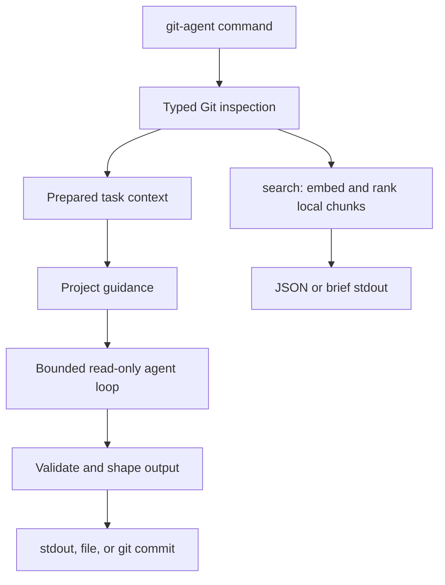

# git-agent

Commit, PR, release, review, simplification, exploration, and repository-search
context for AI-assisted Git work.

When installed, [`skills-mgr`](https://github.com/yusing/skills-mgr) integrates
skill discovery and on-demand guidance reading into message-generation
workflows.

`git-agent` gathers Git evidence with typed Go code, runs a bounded
OpenAI-compatible tool-calling loop, and keeps model tools read-only. The
`commit` command is the only workflow that writes to Git, and it does that after
message generation by handing the final message to `git commit`. Independent
read-only tool calls in one provider turn execute concurrently, while their
outputs return to the conversation in provider order for deterministic replay.

TL;DR: use `commit-msg` when you want a grounded commit message on stdout, use
`commit` when you want the same message created as a Git commit, use
`release-note` for release Markdown, and use `search` when an agent needs fast
local implementation context. Use `explore` when that search needs read-tool
inspection and context-preserving questions. Use `review` for evidence-backed
defects and `simplify` for behavior-preserving cleanup opportunities.

## Quick Start

```sh
# 1. Install the binary
go install github.com/yusing/git-agent/cmd/git-agent@latest

# 2. Generate a commit message from staged changes
git-agent commit-msg

# 3. Or generate and create the commit
git-agent commit
```

By default, message-generation commands use ChatGPT/Codex auth from
`~/.codex/auth.json`. `OPENAI_API_KEY` is the fallback for OpenAI-compatible
provider auth when that file is absent.

`go install` writes to `$(go env GOPATH)/bin` by default; make sure that
directory is on `PATH`.

## Everyday Workflows

<!-- markdownlint-disable MD013 -->

| Workflow | Command | Output |
| --- | --- | --- |
| Staged commit message | `git-agent commit-msg` | Final commit message on stdout |
| Amend commit message | `git-agent commit-msg --amend` | Final amended commit message on stdout |
| Generate and commit | `git-agent commit` | Human trace, then Git commit output |
| Generate and amend | `git-agent commit --amend` | Human trace, then Git amend output |
| Squash PR message | `git-agent pr-message` | Squash merge message on stdout |
| Release body | `git-agent release-note <base> <release>` | Release Markdown on stdout |
| Version bump release body | `git-agent release-note patch` | Release Markdown for latest tag to `HEAD` |
| Uncommitted review | `git-agent review` | Detached task launch JSON |
| Staged review | `git-agent review --staged` | Detached staged-review launch JSON |
| Re-review a completed turn | `git-agent review [--debug] [--fast] --follow-up <turn-id> <prompt...>` | New detached task launch JSON |
| Codebase simplification audit | `git-agent simplify --codebase` | Detached codebase-audit launch JSON |
| Agent-ready codebase exploration | `git-agent explore [--for <target>] <question...>` | Search ID and grounded items JSON |
| Continue an exploration | `git-agent explore --follow-up <search-id> <question...>` | New branch ID and grounded items JSON |
| Print search project identity | `git-agent project_id` | Stable project hash on stdout |
| Agent context search | `git-agent search --agent <query...>` | Brief results, plus progress endpoint when indexing |
| Configure index sync | `git-agent config index.remote <git-url>` | Save a dedicated Git remote for shared revision indexes |
| Push local indexes | `git-agent index sync` | Additively publish all completed local revision indexes |
| Migrate index storage | `git-agent index migrate --to v2` | Deduplicate vectors into immutable content-addressed packs |
| Reclaim index storage | `git-agent index gc --dry-run` | Project local and optional shared-pack garbage-collection projection |
| List search indexes | `git-agent search --ls` | Local index summaries for the current project |
| List indexed files | `git-agent search --ls-files` | Tree of files stored in the selected index |

<!-- markdownlint-enable MD013 -->

## Why git-agent?

LLMs are useful for Git writing, but raw prompts miss repository facts easily:
staged scope, amend intent, recent message style, generated-heavy diffs,
submodule history, guidance files, release ranges, and stdout/stderr contracts.

`git-agent` front-loads those facts before the model writes:

1. It inspects the repository with typed Git plumbing.
2. It builds task-specific evidence for commit, PR, release, or search work.
3. It exposes only narrow read-only tools when the model needs more context.
4. It validates and shapes final output for the requested workflow.

For submodule-only staged updates, normal `commit-msg` and `commit` skip the LLM
entirely and format a deterministic local message.

## What It Provides

<!-- markdownlint-disable MD013 -->

| Surface | What it does |
| --- | --- |
| Prepared Git context | Staged paths, status, stats, diffs, amend base, branch diffs, release ranges, and recent style commits |
| Read-only model tools | Bounded file, diff, and repository inspection tools for generation workflows |
| Guidance discovery | AGENTS/CLAUDE-family project instructions scoped to the task paths |
| Skill delegation | Prompt skill listing plus on-demand reading through `skills-mgr` |
| Commit execution | Optional explicit `git commit --file -` or `git commit --amend --file -` after message generation |
| Release-note writing | Release Markdown from explicit refs or `patch`, `minor`, and `major` shortcuts |
| Review and simplification | Strict JSON reports with repository evidence and replayable SSE agent events |
| Embedding search | Local filesystem or committed-tree context search for agents and humans |
| Debug output | Human console diagnostics with `--debug`; pprof with `--pprof <addr>` |

<!-- markdownlint-enable MD013 -->

## Review and Simplify

See [the Codex review comparison](doc/compare-with-codex-review) for scope,
output, and simplification differences.

`review` and `simplify` are read-only Responses API workflows designed for LLM
harnesses. Both default to all dirty changes, regardless of staging state.

```sh
# Review staged and unstaged work together
git-agent review
# {"command":"review","id":"...","pid":12345,"endpoint":{"network":"unix","address":"/tmp/.../http.sock","url":"http://localhost/events?token=..."}}
git-agent review --wait <id-from-launch-json>

# After applying fixes, re-evaluate an earlier report
git-agent review --follow-up <id-from-launch-json> re-review the fixes

# Review only the Git index
git-agent review --staged

# Choose the lower or upper end of the calculated inspection budget
git-agent review --depth fast
git-agent review --depth thorough

# Show only the scope, depth, and reasoning options intended for coding agents
# Agent help reserves thorough depth for security-related issues or very complex logic
git-agent review --help-agent

# Audit the full repository
git-agent review --codebase

# Find behavior-preserving cleanup opportunities in dirty changes
git-agent simplify
git-agent simplify --wait <id-from-launch-json>

# Allow an orchestrator-owned manifest to expose immutable external evidence
git-agent review --orchestration-artifact /absolute/run/manifest.json

# Limit the report to a lower-priority task focus after flags
git-agent review --staged focus on cancellation and cleanup

# Exercise launch, events, rendering, and wait without provider access
git-agent review --dry-run
```

Exactly one mode may be selected: `--codebase`, `--uncommitted`, or `--staged`.
No mode means `--uncommitted`. Both commands always launch detached and write
one strict launch JSON object to stdout. It contains `command`, durable task
`id`, producer `pid`, and authenticated event `url`. Successful launch writes
nothing to stderr. Matching `--wait <id>` forms write strict, evidence-located
JSON reports to stdout. They have no request deadline by default; `--timeout
<duration>` adds one explicitly. Without `--model` or `OPENAI_MODEL`, `review`
uses `gpt-5.6-sol` and `simplify` uses `gpt-5.6-terra`. Reasoning defaults track
inspection depth: review uses `low`, `medium`, and `high` for
`fast`, `balanced`, and `thorough`; simplify uses `low`, `low`, and `medium`.
An explicit effort flag overrides these defaults.

An eligible completed provider turn can be followed with
`--follow-up <turn-id> <prompt...>`. The detached follow-up inherits the
complete provider input, complete report, scope mode, inspection depth, and
cache identity; it also inspects current repository state. Branched parents
continue every terminal branch and may branch again. Follow-up accepts `--debug`
and `--fast`, rejects every other additional flag, and uses the same SSE and
`--wait` workflow. Three turns preserve the cache lineage before the next turn
starts a new cache lineage while retaining the inherited input and report.
The stable cache key supplies Codex's `session-id` and `thread-id` routing
identity. Each initial inspection or detached follow-up also receives a fresh
`x-codex-turn-metadata` turn identity that remains stable across tool calls and
immediate child branches. An opaque Codex turn-state header, when returned,
follows the cache lineage: child branches and context-preserving detached
follow-ups inherit it, while a cache-lineage reset starts with new routing
state. Follow-ups append only fresh repository diff
context rather than repeating the initial mission and scope prompt.

Without a trailing focus, review reports all actionable findings and simplify
inspects the full authoritative scope. A trailing focus limits the report to
relevant findings or opportunities while still allowing supporting repository
inspection. It cannot expand the selected Git scope or relax evidence rules.

When a remaining inspection is large and independently partitionable, the
model may retire its current conversation and run bounded child inspections in
parallel inside the same detached task. Children retain the selected Git scope,
tool policy, cancellation, and per-conversation budgets. Git-agent merges
validated leaf reports mechanically and publishes branch topology and progress
through the same replayable SSE stream; `--wait` still returns one report.
When a provider turn combines `branch` with ordinary read calls, Git-agent
completes those reads concurrently, appends their outputs in provider order,
and only then forks the completed conversation. Diff-mode runs revalidate their
authoritative snapshot after the reads join, so drift aborts before outputs or
fan-out.
One review tree assigns a stable prompt-cache key to every request. On GPT-5.6
models, Git-agent sends that key, marks an explicit reusable root prefix, and
preserves the breakpoint in children. Branch-specific tools, instructions, or
model changes can still prevent a provider cache hit. Other OpenAI models and
the authenticated ChatGPT Codex endpoint send the same stable key while
retaining automatic caching; custom endpoints receive no undeclared cache
controls.

Diff-based runs calculate a bounded step range from effective changed lines,
changed files, top-level scope dispersion, concrete repository-tool capability
coverage. `--depth fast|balanced|thorough` selects the
lower bound, midpoint, or upper bound; the default is `balanced`. Generated Go
files with standard markers are discounted, not ignored. Automatic review is
capped at 60 model steps and 48 local tool calls; simplify is capped at 45 and
36. `--max-steps` is a mutually exclusive expert override. Codebase mode has no
change-size input and retains the fixed command caps; use `--max-steps` for a
smaller codebase audit. The selected range, inputs, and ceilings are published
as `inspection_budget` in the session event.

Diff-based review and simplification preload a bounded current-change context
and, when available, a previous-`HEAD` context pack for contrast. Current dirty
or staged changes remain authoritative. Uncommitted mode includes dirty changes
from initialized submodules recursively; staged mode remains limited to the
current repository index. Uncommitted inspection honors `.git/info/exclude`
and Git's configured or default global excludes file as well as per-directory
`.gitignore` rules, without entering ignored untracked subtrees; tracked files
remain reviewable even below ignored directories. Allowlist rules cannot
re-include descendants through a still-ignored parent.
Simplification also checks explicitly
for behavior-preserving removal of overengineering such as unnecessary
abstractions, premature generalization, needless indirection or configuration,
redundant state or concurrency, and disproportionate architecture.

`--orchestration-artifact <absolute-path>` enables helper-authorized evidence
for review or simplify. Manifest and declared files must be owner-only regular
files beneath manifest directory and match recorded size and SHA-256. Model can
read only declared IDs through `read_orchestration_artifact`; repository
`read_file` remains repository-confined. Final report adds trusted
`orchestration_manifest_sha256`.

Diff-mode prompts include a bounded context-pack view and bounded unified diff.
Moved submodule pointers include locally available commit summaries. Full
changed-path scope remains available to validation and read-only repository
tools without duplicating every path, status, and stat in the initial request.
The model can page through that complete inventory before requesting narrow
path-specific diffs, and inspect bounded file outlines before selecting
`read_file` ranges. Every review and simplification mode also exposes an
in-process `jq` tool that retrieves one field from repository JSON through an
RFC 6901 JSON Pointer. It follows the same worktree/index/HEAD source isolation
as file reads and does not execute an external `jq` command or general filters.
Requests whose initial serialized estimate reaches the configured context budget
fail before contacting the provider.

Review final reports also include built-in static-check results. For changed Go
files, the bundled golangci-lint check analyzes each affected package with its
complete production and test file context, while reporting diagnostics only for
files in the selected review scope. Codebase checks apply effective Git ignore
rules separately in each initialized repository component. They prune ignored
untracked directories before module discovery. Tracked paths remain in scope,
while ignored private and generated data cannot block inspection.

Both commands offer provider-hosted web search on every normal model step using
the existing OpenAI API-key or ChatGPT/Codex-plan login. API-key auth caps hosted
searches at four per response by default; plan auth leaves provider default
uncapped. `--max-web-searches <n>` overrides either default. No search-specific
credential is needed. A provider that rejects hosted search is retried once
without it, and report summary discloses lookup limitation. Wire behavior follows
the [OpenAI web-search guide](https://developers.openai.com/api/docs/guides/tools-web-search).

Installed `go`, `rustup`, and `ctx7` executables add typed `go_doc`, `rust_doc`,
`context7_library`, and `context7_docs` tools. Missing commands are simply
omitted. These tools run fixed documentation-only argument shapes without shell
access or auto-installation. Context7 works logged out at lower service limits,
as described by its [CLI documentation](https://github.com/upstash/context7/blob/master/docs/clients/cli.mdx).
External queries must contain only public language/library questions—never
secrets, source, diffs, credentials, personal data, or private repository
details. Reports retain exact repository evidence and list deduplicated material
external source URLs or local documentation locators in summary.

The launch object's replayable local endpoint includes live reasoning-summary
progress:

```text
{"command":"review","id":"4YH2S7M6N5QK8J3C9RTPABCD","pid":12345,"endpoint":{"network":"unix","address":"/tmp/git-agent-.../http.sock","url":"http://localhost/events?token=..."}}
```

The detached review or simplification process continues serving events through
the terminal event. `review --wait <id>` or `simplify --wait <id>` waits without
a deadline and prints only the strict final report JSON. Completed reports can
be retrieved repeatedly from any working directory because task IDs are resolved
across project metadata stores. Failed, unknown, malformed, corrupt, dead-producer,
or wrong-command tasks fail with empty stdout; signals cancel an active wait.
Invalid tool arguments and missing evidence paths are returned to the model as
structured errors so it can correct the request instead of aborting the task;
an authoritative repository-state change aborts immediately. Retryable HTTP/2
stream resets and truncated provider streams receive one equivalent streaming
retry. The event stream publishes `runtime.status` with
`phase=retrying_provider`, the retry attempt, and a bounded reason before that
retry; it marks the preceding attempt's live reasoning progress as superseded,
and subsequent reasoning events carry the new provider-attempt number. Strict
report stdout remains unchanged.
Every `response` event includes `input_tokens` and `cached_input_tokens`, so
debug consumers can calculate the provider-reported prompt-cache ratio for each
initial or follow-up request.

See [docs/spec.md](docs/spec.md) for exact mode, schema, tool, and SSE contracts.

## codex-herdr integration

[`git-agent`](https://github.com/yusing/git-agent) works with
[`codex-herdr`](https://github.com/yusing/codex-herdr) to show live review and
simplification progress in a Herdr activity pane. From a managed root Codex
session, run:

```sh
git-agent review --uncommitted
```

The command returns launch JSON while `codex-herdr` follows the review. Its
`pid` identifies the detached process when manual termination is needed.

Git Agent does not require `codex-herdr`; both commands still work normally on
their own.

## Explore

`git-agent explore` combines embedding search with the established read-only
codebase tools and returns synchronous JSON containing an opaque ID and
grounded items. Every item has a description and at least one repository
reference. Explore works from either a Git repository or an ordinary directory;
non-Git sessions use the current directory as their codebase and metadata
identity.

The current directory is the complete exploration boundary. When it is nested
inside a Git repository, the ancestor repository still supplies project identity
and Git metadata, but semantic results, guidance, agent paths, and read tools all
remain relative to—and confined beneath—the selected directory.

In a Git repository, explore can inspect bounded commit lists, HEAD patches,
revision ranges, and files at specified revisions. Commit lists and HEAD
metadata include only changes inside the current-directory boundary. Patch and
file results stay inside that boundary and use paths relative to that directory.

```sh
# Start a grounded codebase exploration
git-agent explore "where is release note evidence prepared?"
# {"id":"...","items":[{"description":"...","references":["path/to/file.go:10-20"]}]}

# Request priority Responses API processing
git-agent explore --fast "where is release note evidence prepared?"

# Focus the answer on diagnosis, change readiness, behavior, or ownership
git-agent explore --for diagnose "why is warm search discovery slow?"
git-agent explore --for change "what must change to avoid this lookup?"
git-agent explore --for behavior "what is the follow-up reset contract?"
git-agent explore --for owner "which package owns batch compatibility?"

# Include console trace and phase timing events on stderr
git-agent explore --debug "where is release note evidence prepared?"

# Continue that exact context; the result receives another independently usable ID
git-agent explore --follow-up <search-id> "which tests define its failure contract?"

# Keep the same context and change only the answer target
git-agent explore --follow-up <search-id> --for owner "which callers reach it?"
```

Concurrent initial calls with the same service tier and query target batch
automatically. Concurrent follow-ups naming the same parent ID, service tier,
and query target become independent sibling branches. Three follow-ups preserve
context; the next invocation succeeds as a fresh search with a reset allowance.
An initial batch and its context-preserving follow-ups are assigned one
prompt-cache key. Git-agent keeps agent instructions unchanged across model
steps and appends each changing budget as replayable developer input, making
each completed request input an exact prefix of the next request input. On
GPT-5.6 models, each appended budget is an explicit cache breakpoint. Provider
cache retention and minimum-prefix rules still apply. Other OpenAI models use
provider-default caching. The authenticated ChatGPT Codex endpoint sends the
stable key without explicit breakpoint options and replays the server's opaque
turn-state header on later requests for sticky routing. Custom endpoints receive
no undeclared cache or Codex routing controls.
`--for diagnose`, `change`, `behavior`, or `owner` uses one compact,
target-neutral system prompt and adds the selected use-case guidance as a
developer message; omission keeps the full universal prompt. A follow-up
inherits its active target unless `--for` selects another one. Switching target
values keeps the neutral system prompt and appends one replayable developer
message with the new guidance. Adding `--for` to a universal-prompt branch
replaces the system prompt, so that transition may miss the prefix cache.
Selecting the active target adds no duplicate.
A depth reset inherits the exhausted session's active target unless `--for`
selects another.
Follow-up IDs are bound to the workspace that created them and are rejected from
another `--cwd`, even when both directories share an ancestor Git repository.
Explore adds no internal timeout: it runs until completion or caller
cancellation. Progress stays on stderr and the result envelope stays on stdout.
Every completed Responses request also writes an `llm.usage` line to stderr with
input, cached-input, cache-write-input, and output token counts.
With `--debug`, Explore additionally streams its console trace and
`explore.phase` timing events to stderr. Every timing event includes the phase
duration and elapsed command time in milliseconds; provider and tool events
additionally identify their model step, and individual tool events name the
tool. Fresh searches report semantic synchronization, discovery, chunking, cache,
embedding,
persistence, query embedding, scoring, and replay subphases. Batch leaders
report collection, prompt setup, agent execution, answer processing, and
persistence; followers report their own coordination and result-wait time.
See [the specification](docs/spec.md) for the exact batching, persistence,
read-tool, reset, and failure contracts.

Explore records redacted batch and branch dispositions under
`${XDG_STATE_HOME:-$HOME/.local/state}/git-agent/$(git-agent project_id)/explore.log`.
Use `git-agent project_id` to print the same stable project hash used by search
metadata and this log path.

## Search

`git-agent search` is embedding-backed implementation-location search. It does
not run the Responses API.

```sh
# Search current filesystem files; Git repositories share a root index
git-agent search "where is release note evidence prepared"

# Compact output for humans
git-agent search --format brief "where are search flags parsed"

# Agent mode: compact output plus progress probe when indexing
git-agent search --agent "where are search flags parsed"

# Search code only, excluding common tests
git-agent search --code --no-tests "commit amend validation"

# Index first, without running a query
git-agent search --index

# Search a committed tree instead of the working filesystem
git-agent search --rev HEAD~1 "guidance discovery"

# Search a cached remote repository
git-agent search --remote https://github.com/yusing/git-agent.git "search flags"

# List search indexes for this project
git-agent search --ls

# List cached remote repositories
git-agent search --ls-remotes

# List indexed files as a tree
git-agent search --ls-files
```

Search reads `OPENAI_EMBEDDING_API_KEY` first, then falls back to
`OPENAI_API_KEY`. Codex/ChatGPT auth is not used for embeddings. Use
`OPENAI_EMBEDDING_BASE_URL`, `OPENAI_EMBEDDING_MODEL`, and
`OPENAI_EMBEDDING_DIMENSIONS` to isolate search embedding config from normal
message-generation config.

Search indexes can be synchronized through a dedicated Git repository:

```sh
git-agent config index.remote git@example.com:team/git-agent-indexes.git
git-agent config index.remote
git-agent index sync
git-agent index migrate --to v2 --dry-run
git-agent index migrate --to v2
git-agent index gc --dry-run
git-agent index gc
git-agent config --unset index.remote
```

Normal search syncs selected revision: committed `HEAD` for filesystem search,
resolved `--rev`, or selected `--remote` revision. Every search confirms remote
freshness before returning. Fresh `explore` calls with a complete warm local
index perform semantic retrieval immediately, then overlap one post-batch
freshness confirmation with the model request and wait for it before publishing
answers. Cold or incomplete indexes skip embedding and synchronization;
`explore` sends no semantic leads and lets the model inspect the repository with
its read-only code tools. Overlapping warm searches batch one confirmation when
its remote observation completes after each waiting search began; sequential
searches perform a new remote ref listing. Warm stores skip object fetch when
the advertised commit is already present and skip commit/push when no local
index data changed.
Failed synchronization does not
publish reusable confirmation.
Working-tree-only vectors remain local. `git-agent index sync` additively
publishes every completed local revision index without embedding new content.
Index repository must be dedicated to `git-agent`; unreachable remote fails
explicitly. Sync progress is reported on stderr in terminals and redirected
output, including bracketed fetch/push object-transfer progress, while final
summary remains on stdout. See [docs/spec.md](docs/spec.md) for exact sync
contracts.

Generated index-store commits are always unsigned. This is enforced only in
the dedicated local index-sync repository and does not change signing settings
for source repositories or `search --remote` caches.

Index repositories begin with schema v1. Upgrade all machines to a client that
validates both schemas, inspect the projected size with `git-agent index migrate
--to v2 --dry-run`, then run `git-agent index migrate --to v2`. Schema v2 stores
canonical float32 vectors once in immutable, content-addressed packs and keeps
small per-revision manifests containing pack references. Migration rewrites the
current index tree but preserves prior v1 data in Git history; it does not
rewrite history, prune revisions, or delete historical Git objects.
Migration progress is reported on stderr while fetching, scanning v1
snapshots, building v2 indexes, installing the migrated tree, and pushing.
Interactive terminals update one transient progress line; redirected stderr
receives newline-delimited phase updates. Dry-run reports only fetch, scan, and
build phases because it never installs or pushes. Re-running migration also
repairs interrupted or mixed v2 trees automatically: validated legacy v1
manifests are merged into v2, removed from the current tree, and the removals
are pushed with the repaired v2 data.

`git-agent index gc` compacts shared local vector payloads from the exact references
in completed indexes and removes recognized incomplete or superseded local payloads.
When `index.remote` is configured, it also removes current-tree packs that no valid
shared snapshot references. Run `--dry-run` to inspect the same candidates without
publishing or deleting. Garbage collection preserves valid manifests and does not
rewrite shared Git history.

SSH remotes try available agent identities first, then unencrypted default
keys in `~/.ssh/id_ed25519`, `id_ecdsa`, `id_rsa`, and `id_dsa`. Encrypted keys
require an agent because git-agent never prompts. Hosts must exist in
`~/.ssh/known_hosts`.

Normal indexing reuses exact matching chunk embeddings from compatible indexes
for the same project or cached remote. This includes filesystem-to-revision and
revision-to-revision reuse, so searching a nearby commit usually embeds only its
changed chunks. Compatible indexes also reference one shared on-disk vector
payload per project or remote cache instead of copying unchanged vectors into
every snapshot. Existing local vector payloads migrate on a later cache write.
`--reindex` skips cross-index reuse, rebuilds the selected source, and appends a
new shared vector generation without changing older snapshots. Interrupted
cache writes remain incomplete and rebuild on the next search instead of being
used as completed indexes. Concurrent `--reindex` requests for the same selected
index coalesce into one fetch and rebuild.

Remote indexing can overlap download and embedding, reducing first-search and
refresh time when the remote supplies selected files early enough.

Index production is a global cross-process single flight per user metadata root.
Local discovery, remote repository initialization and fetch, chunking,
embedding, and persistence run under one cancelable operating-system lock, so
unrelated projects and remotes also index sequentially. The active process may
retain its internal remote fetch/index pipeline while it owns the flight. A
waiting interactive search reports `search: waiting for index worker`;
`--agent` exposes the same state as `waiting`.

Useful flags:

<!-- markdownlint-disable MD013 -->

| Flag | Purpose |
| --- | --- |
| `--scope <paths>` | Limit search or indexing; local paths are current-directory-relative, remote paths are repository-relative |
| `--rev <rev>` | Search a committed Git tree |
| `--remote <url>` | Search a cached remote Git repository URL |
| `--code` | Include source-code files only |
| `--no-tests` | Exclude common cross-language test filenames and test directories from results and `--ls-files` output |
| `--min-score <n>` | Set minimum final hybrid score |
| `--limit <n>` | Limit result count |
| `--format` | Use `json\|brief` for search, `text\|json` for `--ls`, `text\|json\|completion` for `--ls-remotes`, and `tree\|json` for `--ls-files` |
| `--index` | Build missing embeddings without searching |
| `--reindex` | Rebuild existing embeddings and drop stale cache entries |
| `--agent` | Use agent-friendly brief output and serve remote-fetch details and indexing progress on a private local socket when work is needed |
| `--ls` | List search indexes for the current project or `--remote` cache without embedding or querying |
| `--ls-remotes` | List cached remote repositories without embedding, fetching, or querying |
| `--ls-files` | List files in the selected search index without embedding or querying; `--no-tests` filters listed paths without changing the selected index |

<!-- markdownlint-enable MD013 -->

Index inspection commands:

```sh
git-agent search --ls
git-agent search --ls --format json
git-agent search --ls-remotes
git-agent search --ls-remotes --format json
git-agent search --ls-remotes --format completion
git-agent search --ls-files
git-agent search --ls-files --format json
git-agent search --ls-files --no-tests
git-agent search --ls-files --rev HEAD --scope internal/
git-agent search --ls-files --remote https://github.com/yusing/git-agent.git
```

Remote `--ls` output shows the cached bare-repository path even when no completed
search indexes exist, followed by each available index path.

Use [docs/spec.md](docs/spec.md) for exact cache layout and index-selection
contracts.

See `git-agent search --help` and [docs/spec.md](docs/spec.md) for exact
output, cache, ignore-file, and debug behavior.

## CLI Reference

Run any command from another directory by placing the global flag before its
subcommand:

```sh
git-agent --cwd <directory> <command> [args...]
git-agent --cwd ../other-repo review --staged
git-agent --cwd /srv/project search "where is configuration loaded"
```

Relative directories are resolved from the caller's working directory;
absolute directories are accepted directly. The selected directory applies to
repository discovery, search scope, guidance, relative paths, and detached
tasks. For `explore`, it is the complete search and read-tool boundary even when
an ancestor directory is a Git repository. Invalid directories fail before the
subcommand runs.

Everyday commands:

```sh
git-agent commit-msg [--amend] [flags]
git-agent commit [--amend] [flags]
git-agent pr-message [flags]
git-agent project_id
git-agent release-note [--out <file>] [flags] <base> <release>
git-agent release-note [--out <file>] [flags] patch|minor|major
git-agent review [--codebase|--uncommitted|--staged] [flags] [prompt...]
git-agent review --wait <id>
git-agent review [--debug] [--fast] --follow-up <turn-id> <prompt...>
git-agent search [flags] <query...>
git-agent search --ls [--remote <url>] [--format text|json]
git-agent search --ls-remotes [--format text|json|completion]
git-agent search --ls-files [--format tree|json] [--remote <url>] [--rev <rev>] [--scope <paths>] [--no-tests]
git-agent simplify [--codebase|--uncommitted|--staged] [flags] [prompt...]
git-agent simplify --wait <id>
git-agent simplify [--debug] [--fast] --follow-up <turn-id> <prompt...>
git-agent config index.remote [<git-url>]
git-agent config --unset index.remote
git-agent index sync
git-agent index migrate --to v2 [--dry-run]
git-agent index gc [--dry-run]
```

Common generation and inspection flags:

<!-- markdownlint-disable MD013 -->

| Flag | Purpose |
| --- | --- |
| `--model <name>` | Override command default and `OPENAI_MODEL` |
| `--fast` | Request fast service tier |
| `--low`, `--medium`, `--high`, `--xhigh` | Set reasoning effort |
| `--base-url <url>` | Override provider base URL |
| `--timeout <duration>` | Set request timeout; `review`/`simplify` default to none |
| `--depth fast\|balanced\|thorough` | Review/simplify only: select calculated inspection depth and its command-specific reasoning default |
| `--max-steps <n>` | Bound agent loop steps; overrides and conflicts with `--depth` |
| `--max-web-searches <n>` | Review/simplify only: override hosted-search cap |
| `--orchestration-artifact <path>` | Review/simplify only: authorize immutable helper artifact manifest |
| `--dry-run` | Review/simplify only: emit deterministic events without provider access |
| `--follow-up <turn-id> <prompt...>` | Review/simplify only: re-evaluate a successful provider turn |
| `--help-agent` | Review/simplify only: show scope, depth, and reasoning help intended for coding agents |
| `--guidance-family auto\|agents\|claude\|codex\|none` | Force guidance family |
| `--append-prompt <text>` | Add a bounded operator hint |
| `--debug` | Print diagnostics |
| `--pprof <addr>` | Serve Go pprof endpoints |

<!-- markdownlint-enable MD013 -->

`release-note --out <file>` writes the rendered Markdown to the file and streams
a human console trace to stdout.

## Configuration

Persistent settings are stored in
`${XDG_CONFIG_HOME:-~/.config}/git-agent/config.json`. `index.remote` is
global. Displayed URLs redact URL credentials; sync uses same Git transport
and authentication behavior as search `--remote`, without invoking `git`
executable or interactive credential prompts.

Review and simplification completion hooks use the separate global file
`~/.git-agent/settings.json`. This self-contained example formats the complete
payload as Markdown in Go, uses the session title as the ntfy title, and enables
ntfy Markdown rendering:

```json
{
  "hooks": {
    "post_inspection": [
      "printf '%s\\n' {{shellquote (format_markdown .)}} | curl --fail --silent --show-error -H 'Markdown: yes' -H 'Content-Type: text/markdown' -H {{shellquote (printf \"Title: %s\" .Session.Title)}} --data-binary @- https://ntfy.sh/my-topic"
    ]
  }
}
```

The file is trusted configuration: hook entries execute as shell programs.
Replace `my-topic` with the destination topic. The example requires only
`curl`; it introduces no script or JSON-formatting dependency. The
`format_markdown` template function is implemented by git-agent and renders a
branched review as Markdown equivalent to:
A notification from a branched review is rendered as readable text:

```text
Title: review git-agent (uncommitted)

Session ID: 5FTQATWALYB2QYPXVX4FZIBZIC

Usage:
  Input: 42000 (cached: 12000, uncached: 30000)
  Output: 3500 (reasoning: 2100)
  Total: 45500
  Used skills:
    - go
    - security-review
  Tool calls:
    - jq: 3
    - read_file: 5
  Branches created: 2
  Branch b1 (parent: root)
    Model: gpt-5.6-sol
    Reasoning effort: medium
    Input: 14000 (cached: 4000, uncached: 10000)
    Output: 1200 (reasoning: 700)
    Total: 15200

Summary: One high-severity finding.
Recommendation: FIX

Findings:
[HIGH] Stale result is returned
  Aspect: correctness
  Impact: Callers can observe outdated data.
  Evidence:
    - internal/cache.go:42-47 — Cached value bypasses refresh
  Fix: Invalidate the cached value before reading.

Checks:
golangci-lint: findings
  - main.go:38:4 [gocritic] os.Exit will exit, and defer stop() will not run
```

Simplify notifications render `opportunities` instead of `findings`; empty lists
render as `None`. Malformed optional display fields, unrelated lookalike keys,
and unknown future report fields do not break formatting. The exact report
remains available as JSON from `review --wait` or `simplify --wait`. Hook
failures are reported only on the live event stream; they do not replace a
successful report or change wait output.

See [the specification](docs/spec.md) for the v2 payload and template contract.

When `skills-mgr` is available on `PATH`, message-generation commands call
`skills-mgr list` and inject its Markdown output verbatim as a developer prompt
layer. The typed `skills_read` tool delegates to `skills-mgr get`. Git-agent
does not scan skill roots or parse skill configuration, and it invokes no shell.

Default auth comes from:

```text
~/.codex/auth.json
```

The file must include ChatGPT auth:

```json
{
  "auth_mode": "chatgpt",
  "tokens": {
    "access_token": "...",
    "account_id": "..."
  }
}
```

ChatGPT auth sends requests to `https://chatgpt.com/backend-api/codex` with
`Authorization: Bearer <access_token>` and
`ChatGPT-Account-ID: <account_id>`. Requests also identify the Codex client by
sending `originator: codex_cli_rs` and `User-Agent: codex_cli_rs`.

When `~/.codex/auth.json` is absent, `OPENAI_API_KEY` is used as a legacy
OpenAI-compatible fallback. `OPENAI_BASE_URL` only applies to that fallback path
unless `--base-url` is passed explicitly.

Supported environment variables:

<!-- markdownlint-disable MD013 -->

| Variable | Used for |
| --- | --- |
| `OPENAI_API_KEY` | Message-generation fallback auth and search fallback auth |
| `OPENAI_BASE_URL` | Message-generation fallback base URL and search fallback base URL |
| `OPENAI_MODEL` | Message-generation model; defaults to `gpt-5.6-luna` |
| `OPENAI_EMBEDDING_API_KEY` | Search embedding auth |
| `OPENAI_EMBEDDING_BASE_URL` | Search embedding base URL |
| `OPENAI_EMBEDDING_MODEL` | Search embedding model |
| `OPENAI_EMBEDDING_DIMENSIONS` | Search embedding dimensions |
| `OPENAI_EMBEDDING_MAX_INPUT_CHARS` | Search per-input character cap |
| `OPENAI_EMBEDDING_BATCH_INPUTS` | Search embedding request input count |
| `OPENAI_EMBEDDING_BATCH_MAX_CHARS` | Search embedding request character budget |
| `OPENAI_EMBEDDING_CONCURRENCY` | Search embedding request concurrency |

<!-- markdownlint-enable MD013 -->

CLI flags override environment values.

With ChatGPT auth, the `gpt-5.6` alias resolves to `gpt-5.6-sol`. The canonical
`gpt-5.6-sol`, `gpt-5.6-terra`, and `gpt-5.6-luna` identifiers pass through
unchanged.

Behavior defaults:

- `service_tier` is omitted unless `--fast` is set.
- Review reasoning defaults by depth are `fast=low`, `balanced=medium`, and
  `thorough=high`; simplify defaults are `fast=low`, `balanced=low`, and
  `thorough=medium`. Explicit reasoning flags override these defaults.
- Other message-generation commands omit reasoning effort unless `--low`,
  `--medium`, `--high`, or `--xhigh` is set.
- `--append-prompt` can steer style or emphasis only when consistent with the
  task contract and repository evidence.

## How It Works


```mermaid
flowchart TD
    Start["git-agent command"] --> Inspect["Typed Git inspection"]
    Inspect --> Context["Prepared task context"]
    Context --> Guidance["Project guidance"]
    Guidance --> Agent["Bounded read-only agent loop"]
    Agent --> Validate["Validate and shape output"]
    Validate --> Output["stdout, file, or git commit"]
    Inspect --> Search["search: embed and rank local chunks"]
    Search --> SearchOutput["JSON or brief stdout"]
```

`review` and `simplify` stream events from memory over SSE. Detached runs
persist only a small task record under:

```text
~/.git-agent/<project-identity-sha>/background/<task-id>.json
```

Failed task records include bounded debugging context: model/mode identity,
launch repository fingerprint, and recent sanitized tool-call/tool-output
summaries. They do not contain provider credentials, full requests/responses,
or an unbounded repository trace.

Git repositories with `origin` use the SHA-256 of its normalized repository
identity, so common SSH and HTTPS URL spellings and separate clones share task
records. Projects without `origin` use the cleaned absolute project-path SHA.

Search indexes use a project identity metadata root:

```text
~/.git-agent/<project-identity-sha>/search/
```

As with background records, Git repositories with `origin` use normalized
origin identity and otherwise fall back to the cleaned absolute path.

On the next run for an existing project, legacy metadata from
`<project>/.git-agent/` is migrated into the home metadata directory
automatically.

## Local Development

```sh
shadowtree build
shadowtree test
shadowtree install prefix=/usr/local
```

`shadowtree install` builds and installs the binary without writing a build
artifact into the repository. It accepts `destdir` for package-style installs.

Install arguments and environment defaults:

| Input | Default |
| --- | --- |
| `prefix` | `$HOME/.local` |
| `destdir` | empty |
| `fish_config_dir` | `$XDG_CONFIG_HOME/fish`, or `$HOME/.config/fish` |

Fish completions install under `<fish_config_dir>/completions` when the fish
config directory already exists.

## Security and Privacy

- Model tools are read-only and bounded.
- No arbitrary shell command tool is exposed to the model.
- `commit` and `commit --amend` are explicit Git write commands, run only after
  message generation.
- Normal Git config, hooks, signing, and `gpg-agent` behavior apply when
  creating commits.
- Message generation sends prepared repository context to the configured
  provider.
- Review and simplify may send model-authored public documentation queries to
  provider-hosted web search and optional Context7; prompts forbid repository
  content and sensitive data in those queries.
- Search sends indexed chunks and queries to the configured embedding provider.
- API keys and bearer tokens are redacted from debug output and errors.
- Repository tools do not follow symlinks outside the repository.
- Metadata and indexes under `~/.git-agent/` are restricted to
  the current user on platforms with Unix-style permission bits.
- Detached task records contain producer metadata and the exact terminal
  `final` or `error` event. Failed records also contain bounded sanitized
  diagnostics. Records are owner-only and retained indefinitely so a completed
  report remains retrievable.

## Specification

[docs/spec.md](docs/spec.md) is the normative behavior contract for commands,
flags, stdout/stderr, tracing, search indexing, guidance discovery, and model
tool limits. Keep README changes user-facing; update the spec when behavior or
contracts change.
