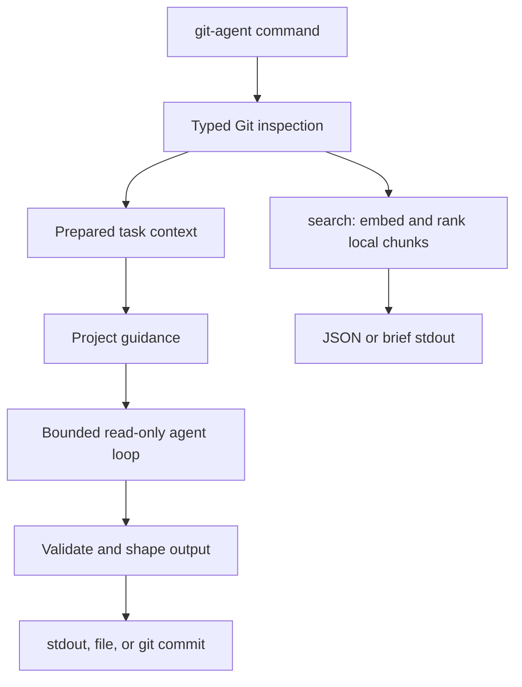

# git-agent

Commit, PR, release, exploration, and repository-search context for AI-assisted
Git work.

When installed, [`skills-mgr`](https://github.com/yusing/skills-mgr) integrates
skill discovery and on-demand guidance reading into message-generation
workflows.

`git-agent` gathers Git evidence with typed Go code, runs a bounded
OpenAI-compatible tool-calling loop, and keeps model tools read-only. The
`commit` command is the only workflow that writes to Git, and it does that after
message generation by handing the final message to `git commit`. Independent
read-only tool calls in one provider turn execute concurrently, while their
outputs return to the conversation in provider order for deterministic replay.

TL;DR: use `commit-msg` when you want a grounded commit message on stdout, use
`commit` when you want the same message created as a Git commit, use
`release-note` for release Markdown, and use `search` when an agent needs fast
local implementation context. Use `explore` when that search needs read-tool
inspection and context-preserving questions.

## Quick Start

```sh
# 1. Install the binary
go install github.com/yusing/git-agent/cmd/git-agent@latest

# 2. Generate a commit message from staged changes
git-agent commit-msg

# 3. Or generate and create the commit
git-agent commit
```

By default, message-generation commands use ChatGPT/Codex auth from
`~/.codex/auth.json`. `OPENAI_API_KEY` is the fallback for OpenAI-compatible
provider auth when that file is absent.

`go install` writes to `$(go env GOPATH)/bin` by default; make sure that
directory is on `PATH`.

## Everyday Workflows

<!-- markdownlint-disable MD013 -->

| Workflow | Command | Output |
| --- | --- | --- |
| Staged commit message | `git-agent commit-msg` | Final commit message on stdout |
| Amend commit message | `git-agent commit-msg --amend` | Final amended commit message on stdout |
| Generate and commit | `git-agent commit` | Human trace, then Git commit output |
| Generate and amend | `git-agent commit --amend` | Human trace, then Git amend output |
| Squash PR message | `git-agent pr-message` | Squash merge message on stdout |
| Release body | `git-agent release-note <base> <release>` | Release Markdown on stdout |
| Version bump release body | `git-agent release-note patch` | Release Markdown for latest tag to `HEAD` |
| Agent-ready codebase exploration | `git-agent explore [--for <target>] <question...>` | Search ID and grounded items JSON |
| Continue an exploration | `git-agent explore --follow-up <search-id> <question...>` | New branch ID and grounded items JSON |
| Print search project identity | `git-agent project_id` | Stable project hash on stdout |
| Agent context search | `git-agent search --agent <query...>` | Brief results, plus progress endpoint when indexing |
| Configure index sync | `git-agent config index.remote <git-url>` | Save a dedicated Git remote for shared revision indexes |
| Push local indexes | `git-agent index sync` | Additively publish all completed local revision indexes |
| Migrate index storage | `git-agent index migrate --to v2` | Deduplicate vectors into immutable content-addressed packs |
| Reclaim index storage | `git-agent index gc --dry-run` | Project local and optional shared-pack garbage-collection projection |
| List search indexes | `git-agent search --ls` | Local index summaries for the current project |
| List indexed files | `git-agent search --ls-files` | Tree of files stored in the selected index |

<!-- markdownlint-enable MD013 -->

## Why git-agent?

LLMs are useful for Git writing, but raw prompts miss repository facts easily:
staged scope, amend intent, recent message style, generated-heavy diffs,
submodule history, guidance files, release ranges, and stdout/stderr contracts.

`git-agent` front-loads those facts before the model writes:

1. It inspects the repository with typed Git plumbing.
2. It builds task-specific evidence for commit, PR, release, or search work.
3. It exposes only narrow read-only tools when the model needs more context.
4. It validates and shapes final output for the requested workflow.

Finish staging before starting a commit command. If HEAD or staged contents
change during message generation, the command stops; rerun it after your Git
changes are finished. Repository/index redirection variables such as
`GIT_DIR` and `GIT_INDEX_FILE` are not supported for commit commands. Ordinary
Git configuration, hooks, and signing still apply.

Commit generation reads related files and project guidance from the index,
not from unstaged or untracked work. Stage guidance changes too if you want
them to apply to the generated message. Normal commit messages follow your
explicit intent and related repository conventions; amend still uses the original message as its anchor. For example,
`git-agent commit --hint "port rF30625"` requests a port subject retaining
that reference, using the repository's sync/port notation. Related history can
supply a task-ID suffix; supply the ID yourself when the association is ambiguous.

For staged submodule updates, normal `commit-msg` and `commit` append a
deterministic local changelog block after model generation. If the staged
changes contain only submodule updates and no `--hint`, they skip the
LLM entirely and format the whole message locally. Supplying a prompt uses model
generation (and requires provider auth), while retaining the local changelog
block. Locally initialized nested submodules are expanded recursively, using repository-relative headings such as `webui/wiki`.

## What It Provides

<!-- markdownlint-disable MD013 -->

| Surface | What it does |
| --- | --- |
| Prepared Git context | Staged paths, status, stats, diffs, amend base, branch diffs, release ranges, and recent style commits |
| Read-only model tools | Bounded file, diff, and repository inspection tools for generation workflows |
| Guidance discovery | AGENTS/CLAUDE-family project instructions scoped to the task paths |
| Skill delegation | Prompt skill listing plus on-demand reading through `skills-mgr` |
| Commit execution | Optional explicit `git commit --file -` or `git commit --amend --file -` after message generation |
| Release-note writing | Release Markdown from explicit refs or `patch`, `minor`, and `major` shortcuts |
| Embedding search | Local filesystem or committed-tree context search for agents and humans |
| Debug output | Human console diagnostics with `--debug`; pprof with `--pprof <addr>` |

<!-- markdownlint-enable MD013 -->

## Explore

`git-agent explore` combines embedding search with the established read-only
codebase tools and returns synchronous JSON containing an opaque ID and
grounded items. Every item has a description and at least one repository
reference. Explore works from either a Git repository or an ordinary directory;
non-Git sessions use the current directory as their codebase and metadata
identity.

The current directory is the complete exploration boundary. When it is nested
inside a Git repository, the ancestor repository still supplies project identity
and Git metadata, but semantic results, guidance, agent paths, and read tools all
remain relative to—and confined beneath—the selected directory.

In a Git repository, explore can inspect bounded commit lists, HEAD patches,
revision ranges, and files at specified revisions. Commit lists and HEAD
metadata include only changes inside the current-directory boundary. Patch and
file results stay inside that boundary and use paths relative to that directory.

```sh
# Start a grounded codebase exploration
git-agent explore "where is release note evidence prepared?"
# {"id":"...","items":[{"description":"...","references":["path/to/file.go:10-20"]}]}

# Request priority Responses API processing
git-agent explore --fast "where is release note evidence prepared?"

# Focus the answer on diagnosis, change readiness, behavior, or ownership
git-agent explore --for diagnose "why is warm search discovery slow?"
git-agent explore --for change "what must change to avoid this lookup?"
git-agent explore --for behavior "what is the follow-up reset contract?"
git-agent explore --for owner "which package owns batch compatibility?"

# Include console trace and phase timing events on stderr
git-agent explore --debug "where is release note evidence prepared?"

# Continue that exact context; the result receives another independently usable ID
git-agent explore --follow-up <search-id> "which tests define its failure contract?"

# Keep the same context and change only the answer target
git-agent explore --follow-up <search-id> --for owner "which callers reach it?"
```

Concurrent initial calls with the same service tier and query target batch
automatically. Concurrent follow-ups naming the same parent ID, service tier,
and query target become independent sibling branches. Three follow-ups preserve
context; the next invocation succeeds as a fresh search with a reset allowance.
An initial batch and its context-preserving follow-ups are assigned one
prompt-cache key. Git-agent keeps agent instructions unchanged across model
steps and appends each changing budget as replayable developer input, making
each completed request input an exact prefix of the next request input. On
GPT-5.6 and GPT-6 models, each appended budget is an explicit cache breakpoint.
Provider cache retention and minimum-prefix rules still apply. Other OpenAI
models use provider-default caching. The authenticated ChatGPT Codex endpoint
sends the stable key without explicit breakpoint options and replays the
server's opaque turn-state header on later requests for sticky routing. Custom
endpoints receive no undeclared cache or Codex routing controls.
`--for diagnose`, `change`, `behavior`, or `owner` uses one compact,
target-neutral system prompt and adds the selected use-case guidance as a
developer message; omission keeps the full universal prompt. A follow-up
inherits its active target unless `--for` selects another one. Switching target
values keeps the neutral system prompt and appends one replayable developer
message with the new guidance. Adding `--for` to a universal-prompt branch
replaces the system prompt, so that transition may miss the prefix cache.
Selecting the active target adds no duplicate.
A depth reset inherits the exhausted session's active target unless `--for`
selects another.
Follow-up IDs are bound to the workspace that created them and are rejected from
another `--cwd`, even when both directories share an ancestor Git repository.
Explore adds no internal timeout: it runs until completion or caller
cancellation. Progress stays on stderr and the result envelope stays on stdout.
Every completed Responses request also writes an `llm.usage` line to stderr with
input, cached-input, cache-write-input, and output token counts.
With `--debug`, Explore additionally streams its console trace and
`explore.phase` timing events to stderr. Every timing event includes the phase
duration and elapsed command time in milliseconds; provider and tool events
additionally identify their model step, and individual tool events name the
tool. Fresh searches report semantic synchronization, discovery, chunking, cache,
embedding,
persistence, query embedding, scoring, and replay subphases. Batch leaders
report collection, prompt setup, agent execution, answer processing, and
persistence; followers report their own coordination and result-wait time.
See [the specification](docs/spec.md) for the exact batching, persistence,
read-tool, reset, and failure contracts.

Explore records redacted batch and branch dispositions under
`${XDG_STATE_HOME:-$HOME/.local/state}/git-agent/$(git-agent project_id)/explore.log`.
Use `git-agent project_id` to print the same stable project hash used by search
metadata and this log path.

## Search

`git-agent search` is embedding-backed implementation-location search. It does
not run the Responses API.

```sh
# Search current filesystem files; Git repositories share a root index
git-agent search "where is release note evidence prepared"

# Compact output for humans
git-agent search --format brief "where are search flags parsed"

# Agent mode: compact output plus progress probe when indexing
git-agent search --agent "where are search flags parsed"

# Search code only, excluding common tests
git-agent search --code --no-tests "commit amend validation"

# Index first, without running a query
git-agent search --index

# Search a committed tree instead of the working filesystem
git-agent search --rev HEAD~1 "guidance discovery"

# Search a cached remote repository
git-agent search --remote https://github.com/yusing/git-agent.git "search flags"

# List search indexes for this project
git-agent search --ls

# List cached remote repositories
git-agent search --ls-remotes

# List indexed files as a tree
git-agent search --ls-files
```

Search reads `OPENAI_EMBEDDING_API_KEY` first, then falls back to
`OPENAI_API_KEY`. Codex/ChatGPT auth is not used for embeddings. Use
`OPENAI_EMBEDDING_BASE_URL`, `OPENAI_EMBEDDING_MODEL`, and
`OPENAI_EMBEDDING_DIMENSIONS` to isolate search embedding config from normal
message-generation config.

Search indexes can be synchronized through a dedicated Git repository:

```sh
git-agent config index.remote git@example.com:team/git-agent-indexes.git
git-agent config index.remote
git-agent index sync
git-agent index migrate --to v2 --dry-run
git-agent index migrate --to v2
git-agent index gc --dry-run
git-agent index gc
git-agent config --unset index.remote
```

Normal search syncs selected revision: committed `HEAD` for filesystem search,
resolved `--rev`, or selected `--remote` revision. Every search confirms remote
freshness before returning. Fresh `explore` calls with a complete warm local
index perform semantic retrieval immediately, then overlap one post-batch
freshness confirmation with the model request and wait for it before publishing
answers. Cold or incomplete indexes skip embedding and synchronization;
`explore` sends no semantic leads and lets the model inspect the repository with
its read-only code tools. Overlapping warm searches batch one confirmation when
its remote observation completes after each waiting search began; sequential
searches perform a new remote ref listing. Warm stores skip object fetch when
the advertised commit is already present and skip commit/push when no local
index data changed.
Failed synchronization does not
publish reusable confirmation.
Working-tree-only vectors remain local. `git-agent index sync` additively
publishes every completed local revision index without embedding new content.
Index repository must be dedicated to `git-agent`; unreachable remote fails
explicitly. Sync progress is reported on stderr in terminals and redirected
output, including bracketed fetch/push object-transfer progress, while final
summary remains on stdout. See [docs/spec.md](docs/spec.md) for exact sync
contracts.

Generated index-store commits are always unsigned. This is enforced only in
the dedicated local index-sync repository and does not change signing settings
for source repositories or `search --remote` caches.

Index repositories begin with schema v1. Upgrade all machines to a client that
validates both schemas, inspect the projected size with `git-agent index migrate
--to v2 --dry-run`, then run `git-agent index migrate --to v2`. Schema v2 stores
canonical float32 vectors once in immutable, content-addressed packs and keeps
small per-revision manifests containing pack references. Migration rewrites the
current index tree but preserves prior v1 data in Git history; it does not
rewrite history, prune revisions, or delete historical Git objects.
Migration progress is reported on stderr while fetching, scanning v1
snapshots, building v2 indexes, installing the migrated tree, and pushing.
Interactive terminals update one transient progress line; redirected stderr
receives newline-delimited phase updates. Dry-run reports only fetch, scan, and
build phases because it never installs or pushes. Re-running migration also
repairs interrupted or mixed v2 trees automatically: validated legacy v1
manifests are merged into v2, removed from the current tree, and the removals
are pushed with the repaired v2 data.

`git-agent index gc` compacts shared local vector payloads from the exact references
in completed indexes and removes recognized incomplete or superseded local payloads.
When `index.remote` is configured, it also removes current-tree packs that no valid
shared snapshot references. Run `--dry-run` to inspect the same candidates without
publishing or deleting. Garbage collection preserves valid manifests and does not
rewrite shared Git history.

SSH remotes try available agent identities first, then unencrypted default
keys in `~/.ssh/id_ed25519`, `id_ecdsa`, `id_rsa`, and `id_dsa`. Encrypted keys
require an agent because git-agent never prompts. Hosts must exist in
`~/.ssh/known_hosts`.

Normal indexing reuses exact matching chunk embeddings from compatible indexes
for the same project or cached remote. This includes filesystem-to-revision and
revision-to-revision reuse, so searching a nearby commit usually embeds only its
changed chunks. Compatible indexes also reference one shared on-disk vector
payload per project or remote cache instead of copying unchanged vectors into
every snapshot. Existing local vector payloads migrate on a later cache write.
`--reindex` skips cross-index reuse, rebuilds the selected source, and appends a
new shared vector generation without changing older snapshots. Interrupted
cache writes remain incomplete and rebuild on the next search instead of being
used as completed indexes. Concurrent `--reindex` requests for the same selected
index coalesce into one fetch and rebuild.

Remote indexing can overlap download and embedding, reducing first-search and
refresh time when the remote supplies selected files early enough.

Index production is a global cross-process single flight per user metadata root.
Local discovery, remote repository initialization and fetch, chunking,
embedding, and persistence run under one cancelable operating-system lock, so
unrelated projects and remotes also index sequentially. The active process may
retain its internal remote fetch/index pipeline while it owns the flight. A
waiting interactive search reports `search: waiting for index worker`;
`--agent` exposes the same state as `waiting`.

Useful flags:

<!-- markdownlint-disable MD013 -->

| Flag | Purpose |
| --- | --- |
| `--scope <paths>` | Limit search or indexing; local paths are current-directory-relative, remote paths are repository-relative |
| `--rev <rev>` | Search a committed Git tree |
| `--remote <url>` | Search a cached remote Git repository URL |
| `--code` | Include source-code files only |
| `--no-tests` | Exclude common cross-language test filenames and test directories from results and `--ls-files` output |
| `--min-score <n>` | Set minimum final hybrid score |
| `--limit <n>` | Limit result count |
| `--format` | Use `json\|brief` for search, `text\|json` for `--ls`, `text\|json\|completion` for `--ls-remotes`, and `tree\|json` for `--ls-files` |
| `--index` | Build missing embeddings without searching |
| `--reindex` | Rebuild existing embeddings and drop stale cache entries |
| `--agent` | Use agent-friendly brief output and serve remote-fetch details and indexing progress on a private local socket when work is needed |
| `--ls` | List search indexes for the current project or `--remote` cache without embedding or querying |
| `--ls-remotes` | List cached remote repositories without embedding, fetching, or querying |
| `--ls-files` | List files in the selected search index without embedding or querying; `--no-tests` filters listed paths without changing the selected index |

<!-- markdownlint-enable MD013 -->

Index inspection commands:

```sh
git-agent search --ls
git-agent search --ls --format json
git-agent search --ls-remotes
git-agent search --ls-remotes --format json
git-agent search --ls-remotes --format completion
git-agent search --ls-files
git-agent search --ls-files --format json
git-agent search --ls-files --no-tests
git-agent search --ls-files --rev HEAD --scope internal/
git-agent search --ls-files --remote https://github.com/yusing/git-agent.git
```

Remote `--ls` output shows the cached bare-repository path even when no completed
search indexes exist, followed by each available index path.

Use [docs/spec.md](docs/spec.md) for exact cache layout and index-selection
contracts.

See `git-agent search --help` and [docs/spec.md](docs/spec.md) for exact
output, cache, ignore-file, and debug behavior.

## CLI Reference

Run any command from another directory by placing the global flag before its
subcommand:

```sh
git-agent --cwd <directory> <command> [args...]
git-agent --cwd /srv/project search "where is configuration loaded"
```

Relative directories are resolved from the caller's working directory;
absolute directories are accepted directly. The selected directory applies to
repository discovery, search scope, guidance, relative paths, and task context.
For `explore`, it is the complete search and read-tool boundary even when
an ancestor directory is a Git repository. Invalid directories fail before the
subcommand runs.

Everyday commands:

```sh
git-agent commit-msg [--amend] [flags]
git-agent commit [--amend] [flags]
git-agent pr-message [flags]
git-agent project_id
git-agent release-note [--out <file>] [flags] <base> <release>
git-agent release-note [--out <file>] [flags] patch|minor|major
git-agent search [flags] <query...>
git-agent search --ls [--remote <url>] [--format text|json]
git-agent search --ls-remotes [--format text|json|completion]
git-agent search --ls-files [--format tree|json] [--remote <url>] [--rev <rev>] [--scope <paths>] [--no-tests]
git-agent config index.remote [<git-url>]
git-agent config --unset index.remote
git-agent index sync
git-agent index migrate --to v2 [--dry-run]
git-agent index gc [--dry-run]
```

Common generation and inspection flags:

<!-- markdownlint-disable MD013 -->

| Flag | Purpose |
| --- | --- |
| `--model <name>` | Override command default and `OPENAI_MODEL` |
| `--fast` | Request fast service tier |
| `--low`, `--medium`, `--high`, `--xhigh` | Set reasoning effort |
| `--base-url <url>` | Override provider base URL |
| `--timeout <duration>` | Set request timeout |
| `--max-steps <n>` | Bound agent loop steps |
| `--follow-up <search-id> <question...>` | Continue an exploration with its saved context |
| `--guidance-family auto\|agents\|claude\|codex\|none` | Force guidance family |
| `--hint <text>` | Add a bounded operator hint |
| `--debug` | Print diagnostics |
| `--pprof <addr>` | Serve Go pprof endpoints |

<!-- markdownlint-enable MD013 -->

`release-note --out <file>` writes the rendered Markdown to the file and streams
a human console trace to stdout.

## Configuration

Persistent settings are stored in
`${XDG_CONFIG_HOME:-~/.config}/git-agent/config.json`. `index.remote` is
global. Displayed URLs redact URL credentials; sync uses same Git transport
and authentication behavior as search `--remote`, without invoking `git`
executable or interactive credential prompts.

When `skills-mgr` is available on `PATH`, message-generation commands call
`skills-mgr list` and inject its Markdown output verbatim as a developer prompt
layer. The typed `skills_read` tool delegates to `skills-mgr get`. Git-agent
does not scan skill roots or parse skill configuration, and it invokes no shell.

Default auth comes from:

```text
~/.codex/auth.json
```

The file must include ChatGPT auth:

```json
{
  "auth_mode": "chatgpt",
  "tokens": {
    "access_token": "...",
    "account_id": "..."
  }
}
```

ChatGPT auth sends requests to `https://chatgpt.com/backend-api/codex` with
`Authorization: Bearer <access_token>` and
`ChatGPT-Account-ID: <account_id>`. Requests also identify the Codex client by
sending `originator: codex_cli_rs` and `User-Agent: codex_cli_rs`.

When `~/.codex/auth.json` is absent, `OPENAI_API_KEY` is used as a legacy
OpenAI-compatible fallback. `OPENAI_BASE_URL` only applies to that fallback path
unless `--base-url` is passed explicitly.

Supported environment variables:

<!-- markdownlint-disable MD013 -->

| Variable | Used for |
| --- | --- |
| `OPENAI_API_KEY` | Message-generation fallback auth and search fallback auth |
| `OPENAI_BASE_URL` | Message-generation fallback base URL and search fallback base URL |
| `OPENAI_MODEL` | Message-generation model; defaults to `gpt-6-luna` |
| `OPENAI_EMBEDDING_API_KEY` | Search embedding auth |
| `OPENAI_EMBEDDING_BASE_URL` | Search embedding base URL |
| `OPENAI_EMBEDDING_MODEL` | Search embedding model |
| `OPENAI_EMBEDDING_DIMENSIONS` | Search embedding dimensions |
| `OPENAI_EMBEDDING_MAX_INPUT_CHARS` | Search per-input character cap |
| `OPENAI_EMBEDDING_BATCH_INPUTS` | Search embedding request input count |
| `OPENAI_EMBEDDING_BATCH_MAX_CHARS` | Search embedding request character budget |
| `OPENAI_EMBEDDING_CONCURRENCY` | Search embedding request concurrency |

<!-- markdownlint-enable MD013 -->

CLI flags override environment values.

With ChatGPT auth, an explicitly selected `gpt-5.6` alias still resolves to
`gpt-5.6-sol`. Canonical model identifiers, including GPT-6 models, pass through
unchanged.

Behavior defaults:

- `service_tier` is omitted unless `--fast` is set.
- Reasoning effort defaults to `xhigh` for `gpt-5.3-codex-spark`,
  `gpt-5.6-luna`, and `gpt-6-luna`; `medium` for `gpt-5.6-sol`,
  `gpt-6-sol`, and `gpt-6-astra`.
  These defaults match the configured model ID; other IDs omit the effort and
  use the provider's default.
- `--low`, `--medium`, `--high`, and `--xhigh` override the model default.
- For normal commit generation, `--hint` supplies explicit intent and
  formatting preferences ahead of default style guidance. It does not change
  which staged changes are committed. Other workflows retain their task-specific
  constraints, including amend's original-subject anchor.

## How It Works


```mermaid
flowchart TD
    Start["git-agent command"] --> Inspect["Typed Git inspection"]
    Inspect --> Context["Prepared task context"]
    Context --> Guidance["Project guidance"]
    Guidance --> Agent["Bounded read-only agent loop"]
    Agent --> Validate["Validate and shape output"]
    Validate --> Output["stdout, file, or git commit"]
    Inspect --> Search["search: embed and rank local chunks"]
    Search --> SearchOutput["JSON or brief stdout"]
```

## Local Development

```sh
shadowtree install
```

The install recipe builds and installs the binary and installs Fish
completions when the configured Fish directory exists.

## Security and Privacy

- Model tools are read-only and bounded.
- No arbitrary shell command tool is exposed to the model.
- `commit` and `commit --amend` are explicit Git write commands, run only after
  message generation.
- Normal Git config, hooks, signing, and `gpg-agent` behavior apply when
  creating commits.
- Message generation sends prepared repository context to the configured
  provider.
- Search sends indexed chunks and queries to the configured embedding provider.
- API keys and bearer tokens are redacted from debug output and errors.
- Repository tools do not follow symlinks outside the repository.
- Metadata and indexes under `~/.git-agent/` are restricted to
  the current user on platforms with Unix-style permission bits.

## Specification

[docs/spec.md](docs/spec.md) is the normative behavior contract for commands,
flags, stdout/stderr, tracing, search indexing, guidance discovery, and model
tool limits. Keep README changes user-facing; update the spec when behavior or
contracts change.
