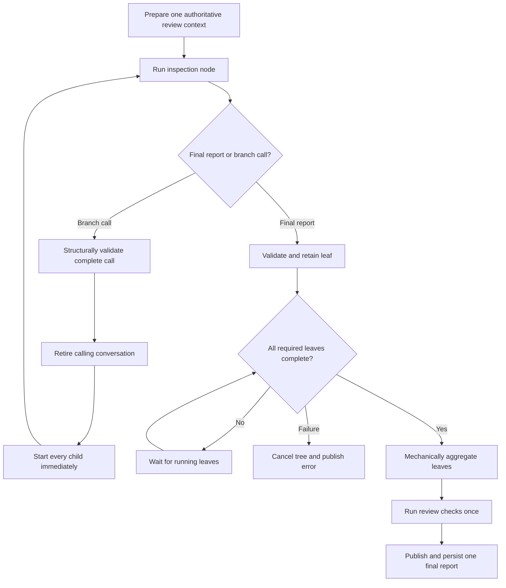

# Branched review and simplify architecture

This document protects REQ-BRANCH-001 through REQ-BRANCH-012. The specification
owns branch policy and observable behavior. This contract records only the
owners, executable interfaces, and cross-boundary sequencing needed to realize
that policy.

## CTR-BRANCH-001 — Add one in-process conversation-tree boundary

Protects REQ-BRANCH-001, REQ-BRANCH-002, REQ-BRANCH-003, REQ-BRANCH-007,
REQ-BRANCH-009, and REQ-BRANCH-012.

Existing packages retain their current responsibilities:

- `internal/tasks/review` owns the policy values declared by REQ-BRANCH-002 and
  REQ-BRANCH-003, the branch interfaces, leaf report ordering, and mechanical
  aggregation.
- `internal/agent` owns one provider conversation, recognizes the terminal
  branch control call, and produces portable child continuations.
- `internal/cli` owns the in-process tree coordinator inside the existing
  detached task, including immediate fan-out, cancellation, tracing, final
  review checks, and terminal persistence.
- `internal/tools` owns the ordinary inspection registry, including execution
  of task-provided `branch_help`; terminal `branch` is not registered there.
- `internal/openai` continues to own provider request and continuation-item
  translation.

The execution path is:



## CTR-BRANCH-002 — Return branch as a terminal node outcome

Protects REQ-BRANCH-004, REQ-BRANCH-006, REQ-BRANCH-007, and REQ-BRANCH-012.

The agent runner returns a closed node outcome:

```go
type NodeResult struct {
    Final  *Result
    Branch *BranchRequest
}
```

Exactly one field is non-nil. A provider response containing `branch` must
contain no other local function call. After validating and recording the call,
the runner returns `BranchRequest`; it does not append an output to or issue
another provider request for the retired conversation.

The call counts as the retiring node's current model step and one local
function-tool call. `ParallelToolCalls` remains false. Concurrent work begins
only after control returns to the tree coordinator.

## CTR-BRANCH-003 — Generate one strict branch interface from task policy

Protects REQ-BRANCH-002 through REQ-BRANCH-005.

`internal/tasks/review` generates two strict interfaces from the current node's
remaining depth, the breadth selected by REQ-BRANCH-002, and the catalog
selected by REQ-BRANCH-003. Both are absent when the node is already at its
depth limit. `branch_help` is an ordinary local function call that returns the
catalog and effort mapping without retiring the conversation:

```json
{
  "name": "branch_help",
  "description": "Use before deciding to use `branch`",
  "parameters": {
    "type": "object",
    "properties": {},
    "required": [],
    "additionalProperties": false
  }
}
```

`branch` remains the terminal control function:

```json
{
  "name": "branch",
  "description": "Fork this large, independently partitionable inspection into child conversations and permanently retire this conversation. Submit all immediate children together. Give each child a distinct natural-language reporting responsibility. Path hints accelerate discovery but never restrict inspection or evidence. Do not branch for repeated opinions, duplicate work, higher effort alone, or work this conversation can finish. Inherit model and effort unless the branch_help catalog and scope difficulty justify an override.",
  "parameters": {
    "type": "object",
    "properties": {
      "branches": {
        "type": "array",
        "minItems": 2,
        "maxItems": "$POLICY_BREADTH",
        "items": {
          "type": "object",
          "properties": {
            "scope": {
              "type": "string",
              "minLength": 1
            },
            "path_hints": {
              "type": "array",
              "items": {
                "type": "string",
                "minLength": 1
              }
            },
            "model": {
              "type": "string",
              "enum": [
                "inherit",
                "$CATALOG_MODEL_IDS"
              ]
            },
            "reasoning_effort": {
              "type": "string",
              "enum": [
                "inherit",
                "$CATALOG_EFFORTS"
              ]
            }
          },
          "required": [
            "scope",
            "path_hints",
            "model",
            "reasoning_effort"
          ],
          "additionalProperties": false
        }
      }
    },
    "required": [
      "branches"
    ],
    "additionalProperties": false
  }
}
```

The shared review registry executes `branch_help` through the ordinary local
tool path, so it consumes one local function-call budget unit and its output is
available to a later `branch` call. Schema decoding and the structural checks
allowed by REQ-BRANCH-005 occur before any child starts. No semantic scope
validator or path-to-scope resolver is introduced.

## CTR-BRANCH-004 — Fork portable context without promoting scope authority

Protects REQ-BRANCH-005, REQ-BRANCH-006, and REQ-BRANCH-008.

The runner retains the provider-visible conversation prefix through the branch
call. For each child it clones fixed task policy, environment, project
guidance, skills, the initial user request, prior portable assistant items, and
exact repository function outputs.

The host then appends one selected function result:

```json
{
  "branch_id": "0.2",
  "parent_branch_id": "0",
  "message": "In scope: Review detached task persistence and heartbeat behavior.",
  "path_hints": [
    "internal/background"
  ],
  "sibling_scopes": [
    "Review CLI parsing and detached launch behavior."
  ],
  "model": "gpt-5.6-sol",
  "reasoning_effort": "high",
  "depth": 1
}
```

Assistant-authored scope remains data in this function result. It is never
interpolated into a developer message. The inherited conversation and this
function result are the complete child input; Git-agent appends no
child-specific developer message.

When the selected model differs from the parent, `internal/openai` omits
encrypted reasoning and other model-specific opaque items while preserving
ordinary messages, function calls, and exact local function outputs. It does
not summarize or reinterpret evidence during conversion.

## CTR-BRANCH-005 — Fan out immediately under one task context

Protects REQ-BRANCH-002, REQ-BRANCH-007, and REQ-BRANCH-010.

After complete structural validation, `internal/cli` invokes every immediate
child runner in the same fan-out operation. Nested calls use the same path.
There is no intervening scheduling owner beyond the tree policy declared by
REQ-BRANCH-002 and REQ-BRANCH-007.

Each child gets a distinct runner state and fresh copies of the effective
per-conversation configuration required by REQ-BRANCH-007. All nodes share the
detached task context, overall optional timeout, prepared repository context,
and diff-mode fingerprint. The first terminal child failure cancels that shared
context; cancellation of siblings is cleanup rather than scheduling.

Provider transport may delay an individual HTTP request, but such delay is not
modeled as Git-agent branch capacity and creates no progress-control API.

## CTR-BRANCH-006 — Keep hints outside repository policy

Protects REQ-BRANCH-005 and REQ-BRANCH-008.

`path_hints` exist only in the branch function result. They do not alter tool
registration, prepared context, repository sources, drift guards, report
schemas, or evidence validation. The inherited review or simplify conversation
remains the only owner of command-specific report semantics; the coordinator
does not inject another instruction layer.

## CTR-BRANCH-007 — Aggregate validated leaves with one pure task function

Protects REQ-BRANCH-009 and REQ-BRANCH-012.

The coordinator records terminal leaves by recursively stable child-array
order. `internal/tasks/review` exposes a pure aggregation function that applies
REQ-BRANCH-009 exactly to those already validated leaf reports and scopes.

The aggregation function has no runtime dependencies beyond its validated
inputs and implements the transformations declared by REQ-BRANCH-009. Its
result passes the existing ordinary report and repository-evidence validator.
Review then crosses the existing static-check and `BuildFinalReviewReport`
boundary once; simplify follows its existing final shaping boundary once.

Branch metadata remains internal and is not added to either public report
schema.

## CTR-BRANCH-008 — Complete only one durable task

Protects REQ-BRANCH-001, REQ-BRANCH-009, and REQ-BRANCH-010.

The existing event server, heartbeat, background store, terminal event, and
repeatable wait remain the sole task lifecycle. `internal/cli` emits `final`
only after all leaves, aggregation, existing validation, and review checks
succeed.

Any required leaf failure produces the existing terminal error after sibling
cancellation. Successful siblings are not persisted as a partial final report.
No branch has an independently waitable durable record.

## CTR-BRANCH-009 — Publish one branch-aware replay log

Protects REQ-BRANCH-011.

`internal/trace` remains the owner of the one globally ordered event sequence,
and `internal/cli` continues to publish that sequence through the existing
authenticated `/events` server. Branch events use the same `trace.Event`
`seq`, `at`, `kind`, and `value` envelope as existing events. The SSE `id`
remains the global `seq`, so current buffering and `Last-Event-ID` replay need
no branch-specific cursor.

The `session` value adds:

```json
{
  "event_schema": "git-agent.events/v2",
  "root_node_id": "root"
}
```

Node IDs are unique within one task, stable across replay, at most 64 bytes,
and contain only ASCII letters, digits, dots, underscores, or hyphens. Clients
must treat them as opaque. Every non-root node carries its explicit parent and
zero-based depth; clients do not derive lineage from ID syntax.

After a branch call passes complete structural validation,
`internal/cli` emits one atomic `branch.fanout` before starting child trace
publication:

```json
{
  "kind": "branch.fanout",
  "value": {
    "parent": {
      "id": "root",
      "parent_id": "",
      "depth": 0
    },
    "children": [
      {
        "id": "b1",
        "parent_id": "root",
        "depth": 1,
        "scope": "Review CLI parsing and detached launch behavior.",
        "model": "gpt-5.6-sol",
        "reasoning_effort": "medium"
      },
      {
        "id": "b2",
        "parent_id": "root",
        "depth": 1,
        "scope": "Review persistence, heartbeat, and cancellation behavior.",
        "model": "gpt-5.6-sol",
        "reasoning_effort": "high"
      }
    ]
  }
}
```

The children preserve branch-call array order. `model` and
`reasoning_effort` are the effective child selections after inheritance. Scope
is untrusted display text limited to 2,048 UTF-8 bytes and 20 lines. Path hints,
prompts, prepared context, tool registries, credentials, and provider state are
not topology metadata.
`branch.fanout` also records that the parent model conversation retired; no
separate retirement event is needed.

Every event emitted by a non-root model conversation is passed through a
node-scoped sink before reaching the task recorder:

```json
{
  "kind": "branch.event",
  "value": {
    "node": {
      "id": "b2",
      "parent_id": "root",
      "depth": 1
    },
    "event": {
      "kind": "reasoning_summary.delta",
      "value": {
        "item_id": "rs_1",
        "provider_attempt": 1,
        "delta": "Inspecting cancellation paths"
      }
    }
  }
}
```

The inner event retains the existing value contract for `request`,
`reasoning_summary.delta`, `reasoning_summary.done`, `runtime.status`,
`tool-call`, `tool-output`, `hosted-tool-call`, `hosted-capability`, `budget`,
and `response`. The outer event owns the only global sequence and timestamp;
the inner event has neither. An unknown inner kind is ignored by consumers
without affecting later topology or task-terminal events.

The terminal `branch` control call is represented by `branch.fanout`, not by an
ordinary unmatched `tool-call`. Repository and documentation functions inside
a child continue to produce paired inner `tool-call` and `tool-output` events.

After a leaf report passes existing report and repository-evidence validation,
the coordinator emits:

```json
{
  "kind": "branch.completed",
  "value": {
    "node": {
      "id": "b2",
      "parent_id": "root",
      "depth": 1
    },
    "summary": "Cancellation and heartbeat paths were inspected.",
    "item_count": 2
  }
}
```

`summary` is untrusted text limited to 4,096 UTF-8 bytes and 40 lines, and
`item_count` is the nonnegative validated leaf finding or opportunity count.
The complete leaf report is not duplicated in this event; every leaf item
appears through the one merged task-level final report.

A child failure emits a bounded `branch.failed` before the coordinator
publishes the existing task-level terminal `error`:

```json
{
  "kind": "branch.failed",
  "value": {
    "node": {
      "id": "b2",
      "parent_id": "root",
      "depth": 1
    },
    "message": "repository snapshot changed; rerun review"
  }
}
```

The failure message is limited to 4,096 UTF-8 bytes and 40 lines.
`branch.completed` and `branch.failed` are lifecycle events, not stream
terminals. Only outer task-level `final` and `error` close the stream; that
terminal also ends any sibling activity canceled during failure cleanup.

Aggregate coordinator progress remains unwrapped so branch-unaware consumers
retain useful task activity:

```json
{
  "kind": "runtime.status",
  "value": {
    "phase": "branches_running",
    "branch_progress": {
      "active": 4,
      "completed": 3,
      "failed": 0,
      "total_known": 9
    }
  }
}
```

The coordinator also uses `phase=aggregating_branches` before existing
post-review check phases. It does not publish queued or capacity fields because
Git-agent has no application queue or global branch-capacity policy.

Emission ordering is part of the interface:

1. `session` precedes branch topology.
2. `branch.fanout` precedes every scoped event for its children.
3. A retired node emits no later `branch.event`.
4. `branch.completed` follows that leaf's final scoped activity and validation.
5. `branch.failed` precedes the task-level terminal `error`.
6. The task-level `final` follows all required leaf completions, mechanical
   aggregation, validation, and review checks.

Existing consumers ignore the new outer branch kinds and continue to receive
unwrapped aggregate status plus the task-level final result. Branch-aware
consumers can construct independent activity lineage using only this contract;
Git-agent implementation does not depend on any consumer's source code.
Existing trace compaction, event-size bounds, diagnostic sanitization, and
secret-handling rules remain authoritative.

## CTR-BRANCH-010 — Verify the new boundaries rather than restating policy

Protects REQ-BRANCH-001 through REQ-BRANCH-012.

Focused tests cover these implementation boundaries:

- dynamic branch-definition construction and omission;
- terminal `NodeResult` behavior and mixed-call rejection;
- same-model and cross-model portable forks;
- atomic structural validation before fan-out;
- immediate nested fan-out without scheduler machinery;
- non-authoritative propagation of path hints;
- stable pure aggregation and one-time review checks;
- shared cancellation and one terminal durable result;
- atomic fan-out topology before scoped child events;
- globally ordered replay of concurrently emitted `branch.event` values;
- branch lifecycle events that cannot terminate the task stream;
- branch-unaware consumption without child-event interleaving; and
- the unchanged single-conversation path when no branch call occurs.

Requirement-level acceptance values and report semantics are tested from their
declarations in `doc/spec/branched-review.md` rather than copied into this
contract.
