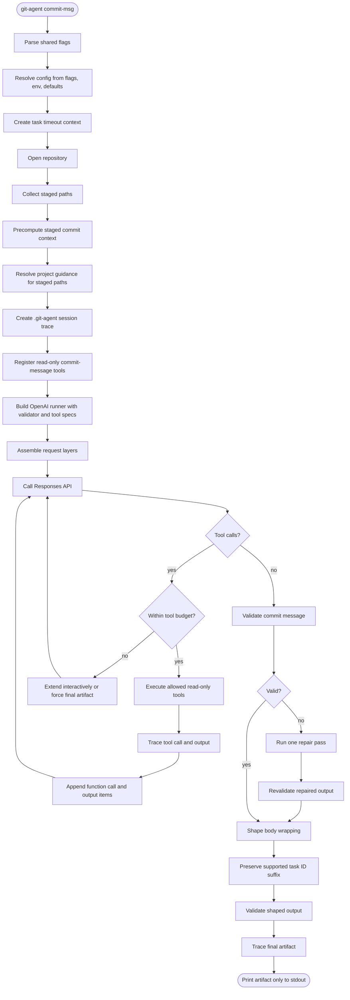
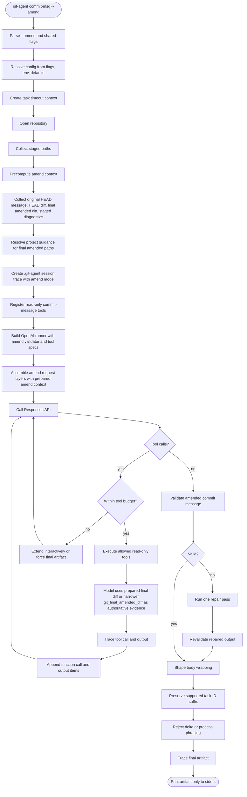
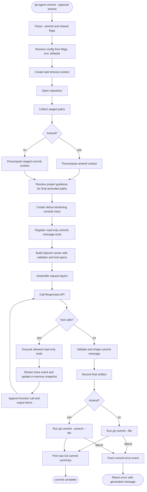
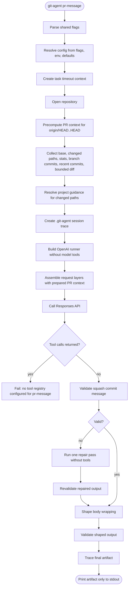
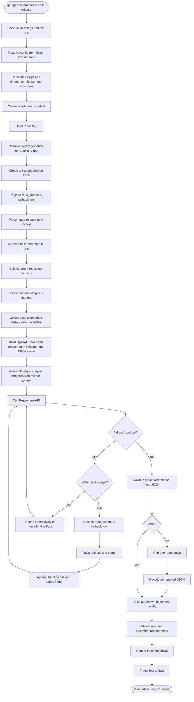

# git-agent specification

## 1. Purpose and non-goals

### Purpose

`git-agent` is a standalone Go binary for Git-related generation workflows.
It:

- gathers Git and repository context without shelling out to ad hoc scripts
- uses the official OpenAI Go SDK against an OpenAI-compatible Responses API
  endpoint
- runs a bounded, read-only, tool-calling agent loop
- emits only the final commit message or release note on stdout for
  message-generation commands
- can optionally create the Git commit after generating a message
- preserves project guidance behavior close to Codex for AGENTS-family files

Supported workflows:

- `git-agent commit-msg`
- `git-agent commit-msg --amend`
- `git-agent commit`
- `git-agent commit --amend`
- `git-agent pr-message`
- `git-agent release-note <base> <release>`

### Non-goals

`git-agent` must not:

- execute arbitrary shell commands on behalf of the model
- merge AGENTS-family and CLAUDE-family guidance into the same prompt
- implement provider-specific plugins beyond OpenAI-compatible Responses API
  options exposed through the official SDK
- add write-capable repository tools
- preserve exact raw `git` CLI output byte-for-byte when a typed Go equivalent
  is clearer and stable

## 2. User-facing commands

### Commands

#### `git-agent commit-msg`

Generate a commit message from the staged diff in the current repository.
The command precomputes staged paths, status, stats, recent style commits, and
the bounded staged diff before generation so the authoritative staged scope is
visible before any optional follow-up tool calls. For generated-heavy staged
changes, the request may compact dominant generated hunks into a context pack,
but it must still include raw outlier diffs for small handwritten change
clusters. Large or capped staged diffs expose a path-filtered staged-diff tool
so the model can inspect omitted high-churn or secondary clusters without
reading unrelated hunks.

#### `git-agent commit-msg --amend`

Generate a commit message for the final post-amend commit result, not a delta
note about the newly staged changes. The current HEAD commit message is the
anchor for subject, scope, task IDs, and high-level intent; staged cleanups or
refinements must not replace a broad original message with a narrow delta
message. The command precomputes amend context before generation: original HEAD
message, latest HEAD commit metadata, HEAD-vs-parent paths/stats/diff, staged
diagnostics, recent style commits, and the bounded final amended diff versus
HEAD's first parent. This gives the model enough latest-commit context before
any optional follow-up tool calls.

#### `git-agent commit`

Generate a commit message from staged changes using the same prompt,
validation, shaping, guidance, and read-only model tools as `commit-msg`, then
create the commit by running `git commit --file -` in the
repository root. This mode writes no `.git-agent/sessions/*/events.ndjson`
trace. On success, stdout streams a human console trace while
generating the message, then prints Git's raw commit summary after `git commit`
succeeds. Trace lines use short local times such as `15:04:05 INF final`, color
field keys when stdout is a terminal, and render long or multiline values as
indented preview blocks. Because commit creation is delegated to Git, normal Git
config,
hooks, `commit.gpgSign`, system `gpg`, and `gpg-agent` behavior apply. If commit
creation fails after message generation, including because signing fails or a key
is locked, the command returns nonzero, keeps the streamed trace events on
stdout, and reports both the generated message and the Git error so the user can
commit manually.

#### `git-agent commit --amend`

Generate the final amended commit message using the same semantics as
`commit-msg --amend`, then amend the commit by running
`git commit --amend --file -` in the repository root. The
success stdout contract matches `git-agent commit`: human console trace lines
followed by Git's raw commit summary.
Amend mode preserves the original HEAD author and uses the current configured
committer. The original HEAD subject is validated as the amend message anchor so
model output cannot silently replace it with a staged-delta-only subject. The
message-generation request is seeded with the same prepared amend context as
`commit-msg --amend`.

#### `git-agent pr-message`

Generate a squash merge commit message for the current branch versus
`origin/HEAD`. The command treats the diff from `origin/HEAD` to `HEAD` as the
authoritative scope, precomputes branch evidence before generation, and uses
branch commits as supporting evidence.

#### `git-agent release-note <base> <release>`

Generate a GitHub release body for the range from `<base>` to `<release>`.
The command precomputes release-note evidence in Go before generation and then
asks the model to write from that prepared context, with only minimal read-only
fallback tools available for rare gaps.

### Flags

All subcommands reserve this shared flag surface:

- `--model`
- `--fast`
- `--low`
- `--medium`
- `--high`
- `--xhigh`
- `--base-url`
- `--timeout`
- `--max-steps`
- `--guidance-family`
- `--debug`

Flag behavior:

- `--fast`: send `service_tier=priority`
- `--low`: send `reasoning.effort=low`
- `--medium`: send `reasoning.effort=medium`
- `--high`: send `reasoning.effort=high`
- `--xhigh`: send `reasoning.effort=xhigh`
- default: omit both `service_tier` and `reasoning`

`commit-msg` and `commit` additionally support:

- `--amend`

### Authentication and environment variables

Default auth uses ChatGPT/Codex credentials from `~/.codex/auth.json`.
The file must set `"auth_mode": "chatgpt"` and include
`tokens.access_token` plus `tokens.account_id`. ChatGPT auth defaults the
provider base URL to `https://chatgpt.com/backend-api/codex` and sends
`Authorization: Bearer <access_token>` plus
`ChatGPT-Account-ID: <account_id>`.

`OPENAI_API_KEY` is a legacy fallback for OpenAI-compatible providers when
`~/.codex/auth.json` is absent.
`OPENAI_BASE_URL` applies only to that legacy API-key path; ChatGPT auth uses
`https://chatgpt.com/backend-api/codex` unless `--base-url` is passed
explicitly.
Supported environment variables:

- `OPENAI_API_KEY`
- `OPENAI_BASE_URL`
- `OPENAI_MODEL`

Resolution order:

1. explicit CLI flag
2. `~/.codex/auth.json` ChatGPT auth
3. environment variable fallback, including `OPENAI_API_KEY` auth
4. internal default when defined by that subsystem

### stdout / stderr contract

- stdout for generation-only commands: final generated artifact only
- stdout for `commit` / `commit --amend`: streaming human console trace lines
  while generating the message, followed by Git's raw commit summary after
  success
- stderr: diagnostics, debug output, validation failures, provider/tool loop
  summaries when `--debug` is enabled, and stderr emitted by a successful
  delegated `git commit`
- generation-only commands write a JSON trace session under `.git-agent/sessions/`
  regardless of `--debug`; `--debug` prints the session directory on stderr
- `commit` / `commit --amend` do not write an on-disk NDJSON trace session;
  their human console trace lines are streamed to stdout
- `commit` / `commit --amend` delegate commit creation to `git commit`, so Git
  config, hooks, `commit.gpgSign`, system `gpg`, and `gpg-agent` behavior apply
- if commit creation fails after message generation, the command returns nonzero
  after streaming trace events to stdout; the final error includes the
  generated commit message plus the commit failure so the user can commit
  manually

### Exit behavior

Nonzero exit codes are returned for:

- invalid CLI arguments
- missing repository context
- missing required environment configuration
- provider/API failures
- tool execution failures
- validation failures that cannot be repaired

### Build and install

The repository provides a `Makefile` with:

- `make build`: build `bin/git-agent`
- `make test`: run `go test ./...`
- `make install`: install the built binary to `$(DESTDIR)$(BINDIR)/git-agent`
  and, if the fish config dir exists, install fish completions

Defaults:

- `PREFIX ?= ~/.local`
- `BINDIR ?= $(PREFIX)/bin`
- `XDG_CONFIG_HOME ?= $(HOME)/.config`
- `FISH_CONFIG_DIR ?= $(XDG_CONFIG_HOME)/fish`
- `FISH_COMPLETIONS_DIR ?= $(FISH_CONFIG_DIR)/completions`

## 3. Architecture

### Package map

- `cmd/git-agent`: process entrypoint
- `internal/cli`: argument parsing and command dispatch
- `internal/config`: environment and flag materialization
- `internal/agent`: bounded agent loop contract
- `internal/openai`: official OpenAI Go SDK adapter for the Responses API
- `internal/guidance`: project guidance discovery and rendering
- `internal/gitctx`: typed repository inspection
- `internal/tools`: curated read-only tool registry
- `internal/tasks/commitmsg`: commit message behavior
- `internal/tasks/releasenote`: release note behavior
- `internal/textutil`: shared normalization and output shaping helpers
- `internal/trace`: JSON session recorder for requests, responses, tool calls,
  and tool outputs

### Request assembly layers

Every task request is assembled using Codex-style layering:

1. top-level Responses `instructions` containing task-level system behavior
2. developer message containing the read-only tool policy
3. developer message containing environment context
4. developer message containing project guidance
5. task-specific user prompt
6. strict function tool registry for that task, if that task exposes tools

The project guidance block is not treated as ordinary user text. It is a
separate injected layer mirroring Codex’s style.

Environment context includes:

- current working directory
- repository root
- command name
- mode or release range
- selected guidance family
- stdout contract

Tool policy states that tools are read-only, cannot run arbitrary shell, cannot
mutate files/index/refs/remotes/network/provider state, and return JSON
envelopes with truncation metadata.

The OpenAI adapter uses the official `github.com/openai/openai-go/v3` package.
It converts internal request items into `responses.ResponseNewParams`,
including:

- `Instructions`
- structured input message items
- `function_call` items
- `function_call_output` items
- strict function tool definitions
- `Store: false`
- `ParallelToolCalls: false` when tools are present
- Never send `max_tool_calls` on `/responses`; this provider class rejects it. Enforce tool-call ceilings locally in the runner only, and do not re-add outbound `max_tool_calls`.

### Agent loop lifecycle

1. resolve config and repo context
2. for commit-message tasks, collect staged paths
3. create a JSON trace session, or a stdout-streaming human console trace for
   `commit` / `commit --amend`
4. precompute task context before the first provider call: staged context for
   normal commit messages, amend context for `--amend`, PR context for
   `pr-message`, or release-note context for `release-note` including resolved
   refs, parent commits, submodule gitlink changes, submodule history when
   locally available, and repository ownership/link hints
5. resolve project guidance for the task target paths, after context prep when
   prepared paths define the target scope
6. build task-specific instructions, developer context, and initial user prompt
7. send request to the Responses API through the official OpenAI Go SDK
8. record each request and response in the active trace
9. if the model requests tools, execute only registered read-only tools
10. record each tool call and tool output in the active trace
11. append function-call and function-call-output items and continue until final
    text is returned
12. validate output against task rules
13. if invalid and repair budget remains, run exactly one repair pass
14. print final text to stdout for generation-only commands, or stream human
    console trace lines while generating the message and then print Git's raw
    commit summary after creating or amending through `git commit`

### Subcommand execution flow graphs

#### `git-agent commit-msg`



#### `git-agent commit-msg --amend`



#### `git-agent commit` / `git-agent commit --amend`



#### `git-agent pr-message`



#### `git-agent release-note <base> <release>`



### Bounded execution

The runtime must enforce:

- maximum model steps
- maximum tool calls
- maximum bytes/lines per tool result
- per-request timeout
- overall task timeout

### Session trace format

Generation-only commands store persistent traces under:

```text
.git-agent/sessions/<timestamp>-<command>/
```

Persistent trace directories contain:

```text
events.ndjson
session.json
artifacts/<sha256>.txt
```

`events.ndjson` is an append-only NDJSON event stream. `session.json` is a
compacted snapshot for humans and test diagnostics. Large string values are
stored under `artifacts/` and replaced by artifact metadata in both files.

`git-agent commit` and `git-agent commit --amend` do not create an on-disk trace
session. They stream readable console trace lines to stdout. Console trace lines
are summarized, so they keep the event type and useful counters without dumping
raw request/response JSON or full diffs. Large or multiline string values in
stdout stream traces are rendered as indented preview blocks with truncation
metadata because there is no artifact directory and raw multiline patches are
not console-friendly.

Each stdout trace line has this shape:

```text
15:04:05 INF session.started command=commit
```

On-disk trace contents include:

- session metadata: command, mode/range, repository summary, staged paths when
  relevant
- every Responses request sent to the provider, with API keys redacted
- every provider response, including raw response JSON when available from the
  SDK
- every model-requested tool call
- every tool output returned to the model
- final generated artifacts and commit errors when relevant

Trace files are diagnostic artifacts and are ignored by Git via `/.git-agent/`.

## 4. Guidance resolution

### Goal

Follow Codex-style scoped project guidance formatting while preserving a
single-family rule:

- same-family scoped files may concatenate
- different-family files never concatenate

### Family precedence

Default family selection:

1. AGENTS-family
2. CLAUDE-family fallback if and only if no AGENTS-family guidance was found
3. no guidance if neither family is present

### Family membership

AGENTS-family candidates:

- `AGENTS.override.md`
- `AGENTS.md`

CLAUDE-family candidates:

- `CLAUDE.md`


### Scope discovery

Guidance resolution walks from repository root to the target directory in order.
For each directory in that chain:

1. choose at most one file from the active family using that family’s filename
   precedence
2. append it to the resolved source list

Example:

- `/repo/AGENTS.md`
- `/repo/frontend/AGENTS.md`
- `/repo/frontend/admin/AGENTS.md`

For a target inside `frontend/admin`, all three files are concatenated in that
order.

Example of disallowed cross-family merge:

- `/repo/AGENTS.md`
- `/repo/frontend/CLAUDE.md`

Result: choose AGENTS-family only, ignore CLAUDE-family entirely.

### Rendered format

The injected guidance block uses a Codex-style outer wrapper:

```text
# AGENTS.md instructions for /absolute/target/path

<INSTRUCTIONS>
<PROJECT_DOC path="AGENTS.md">
...
</PROJECT_DOC>

<PROJECT_DOC path="frontend/AGENTS.md">
...
</PROJECT_DOC>
</INSTRUCTIONS>
```

Notes:

- the heading remains `AGENTS.md instructions for ...` for parity with Codex’s
  visible wrapper shape
- the chosen family may still be CLAUDE-family under the hood
- inner path tags preserve provenance and scoped boundaries using
  repository-relative paths to avoid leaking absolute machine paths

### Guidance target path

Guidance must resolve against the task target path, not blindly against process
cwd.

Task defaults:

- `commit-msg`: staged paths when present in normal mode; final amended paths
  for `--amend`; if no task paths are available, current repository root
- `pr-message`: changed paths between `origin/HEAD` and `HEAD`; if no changed
  paths are available, current repository root
- `release-note`: current repository root

For `commit-msg`, guidance is resolved across all task paths. Normal mode uses
staged paths; amend mode uses the final amended paths so guidance can cover the
latest HEAD commit being amended as well as staged refinements. Family selection
remains global for the task: if any task path has AGENTS-family guidance,
AGENTS-family is selected and CLAUDE-family files are ignored for the whole
request. Sources are de-duplicated while preserving root-to-leaf order.
`pr-message` uses the same family-selection behavior, but its target paths come
from the current-branch diff against `origin/HEAD`.

## 5. Tool system

### Principles

- read-only only
- typed tool contracts
- no arbitrary shell access
- no generic “run any git command” escape hatch
- bounded output with explicit truncation markers

### Shared repository tools

Shared tools:

- `repo_summary`
- `list_files`
- `read_file`
- `search_files`

### Commit message tools

Commit message tools:

- `git_staged_paths`
- `git_staged_status`
- `git_staged_stat`
- `git_staged_diff`
- `git_staged_diff_for_paths`
- `git_recent_commits`
- `git_head_show`
- `git_diff_against_parent`
- `git_final_amended_diff`
- `git_amend_delta`
- `git_show_file_at_rev`

`pr-message` does not expose tools to the model. It precomputes `origin/HEAD`
base metadata, changed paths, diff stats, branch commits, recent style commits,
and a bounded full diff in Go before the first provider call.

### Release note tools

Release-note tools:

- `resolve_ref`
- `git_log_range`
- `gitmodules_table`
- `submodule_gitlink_range`
- `submodule_log_range`
- `repo_kind`

### Tool I/O expectations

Each tool definition must provide:

- stable tool name
- description
- strict JSON schema for arguments using `additionalProperties: false`
- required fields for mandatory arguments
- bounds for numeric cap arguments
- JSON result envelope with stable fields
- explicit truncation metadata when output is capped

Tool result envelope:

```json
{
  "ok": true,
  "tool": "git_staged_diff",
  "data": {},
  "truncated": false
}
```

The tool loop records both the model's function-call arguments and the exact
tool-output envelope sent back to the model.

### Limits

Each tool result must honor caps for:

- bytes
- lines
- entries
- nested commit/submodule log counts

The model must be told when output was truncated so it can request narrower
follow-up reads.

## 6. Task behavior

### Commit message: normal mode

Behavior:

- inspect the staged diff only
- treat staged paths as authoritative scope
- precompute staged context before generation, with changed paths, status,
  stats, recent style commits, previous HEAD paths/stats/diff for contrast,
  and a bounded staged diff
- when the bounded staged diff is truncated, precompute an additional focus
  diff for high-churn paths that were omitted or cut off, unless the change is
  handled by generated-heavy compaction/outlier rules
- compact generated-heavy staged changes with a context pack only when raw
  outlier diffs for small handwritten change clusters remain visible in the
  initial request
- use recent commit history as style reference only
- use previous HEAD paths/stats/diff only as contrast to understand what was
  already done, not as current staged scope; for large previous diffs, paths
  and stats preserve contrast shape even when the previous diff text is capped
- allow the model to request extra related file reads when the diff is
  ambiguous
- allow the model to request path-filtered staged diffs for omitted or
  high-churn clusters when the bounded full staged diff is large or truncated
- cover each distinct high-signal staged change cluster present in the staged
  diff, rather than letting a dominant cluster hide a secondary behavior change
- avoid copying phrasing from recent commits or previous HEAD diff as if it
  were current staged work
- prefer `refactor` when staged evidence shows extraction, relocation,
  deduplication, or internal reorganization of existing behavior, even if new
  helper files or tests are added
- use `feat` only when the staged diff introduces a genuinely new user-visible
  capability, API, command, config option, or behavior

Output rules:

- subject line first
- blank line before body only when body exists
- no fences
- no explanations
- body lines wrapped to target width (target width: 72 characters after output
  shaping; long unbreakable tokens such as URLs may exceed the limit only when
  they cannot be wrapped safely)

### Commit message: amend mode

Behavior:

- describe the final amended commit as one commit versus its parent
- never narrate the amended result as “previous commit plus extra changes”
- precompute prepared amend context before generation, including original HEAD
  message, latest HEAD commit metadata, HEAD-vs-parent paths/stats/diff,
  staged paths/status/stats/diff diagnostics, submodule diagnostics when
  present, recent style commits, and final amended paths/stats/diff versus
  HEAD's first parent
- expose the latest HEAD commit context in the initial request so the model
  does not have to infer the commit being amended from an empty prompt or from
  staged-delta tools alone
- treat `git_final_amended_diff` as authoritative; it overlays staged changes
  on current HEAD and compares the final amended result against the first parent
- treat prepared final amended diff fields as authoritative initial evidence;
  use `git_final_amended_diff` only for narrower follow-up when the prepared
  diff is truncated or ambiguous
- treat the current HEAD message as the output anchor; preserve its subject and
  high-level story, revising body details only when the final amended diff
  proves them false
- use current HEAD, HEAD-vs-parent, and staged-vs-HEAD views only as diagnostic
  inputs
- never base the subject or narrative on staged paths or staged delta alone

Output rules:

- one narrative only
- the original HEAD subject must be preserved by validation
- no delta/process phrasing such as “also”, “this amend”, or “in addition”
- preserve task IDs or scope markers only when still supported by the final
  diff

### PR message mode

Behavior:

- describe the current branch as one squash merge commit versus `origin/HEAD`
- treat the `origin/HEAD` to `HEAD` diff as authoritative scope
- use the prepared PR context as authoritative evidence without tool calls
- use branch commits only as supporting evidence for intent, grouping, and task
  IDs
- ignore staged and unstaged work unless it is already committed at `HEAD`
- do not emit pull request prose, review instructions, or release notes

Output rules:

- subject line first
- blank line before body only when body exists
- no fences
- no explanations
- no commit-by-commit changelog
- body lines wrapped to target width using the same commit-message shaping
  rules

### Release note generation

Behavior:

- peel and validate both refs
- generate a parent-repository commit log for the selected range
- inspect submodule gitlink changes
- include submodule commit groups only when the gitlink moved and local commit
  history is available
- optimize prose for deployers/operators rather than developers

Output rules:

- first printable line starts with `### `
- no preamble
- no duplicate section narratives
- include `### Full Changelog` when the range touched code
- parent-repo commits appear first in the full changelog
- submodule groups appear after parent commits
- commit/repo links must follow repository ownership rules

### Validation

Each task owns a validator.

Commit message validator checks at minimum:

- non-empty output
- no code fences
- subject present
- no stray commentary
- amend mode does not use process/delta phrasing
- amend mode preserves the original HEAD subject
- body lines stay within the target width after output shaping (target width: 72
  characters after shaping, except for long unbreakable tokens such as URLs)

Release note validator checks at minimum:

- first printable line starts with `### `
- no forbidden preamble
- heading/content structure valid
- `### Full Changelog` included when required

### Repair strategy

If validation fails:

1. summarize the validation errors
2. run one repair pass through the model
3. revalidate
4. return an error if still invalid

## 7. Testing strategy

### Unit tests

Unit coverage should include:

- prompt normalization
- CLI parsing
- guidance family selection
- guidance scoped ordering
- validator rules
- truncation metadata
- strict tool schemas
- tool result envelopes
- trace redaction and trace file creation

### Golden tests

Golden tests should cover:

- commit message prompt/context assembly
- amend prompt/context assembly
- release note prompt/context assembly
- guidance rendering blocks

### Fake API server tests

Use a local fake OpenAI-compatible server to test:

- tool-call round trips
- finish states
- validation repair pass behavior
- malformed provider responses
- official SDK request compatibility
- stdout-only artifact behavior

### Integration tests

Use temporary repositories to test:

- staged commit message generation scenarios
- amend scenarios
- staged-path guidance scoping
- detached HEAD
- root commit handling
- release-note tag/range handling
- submodule gitlink movement and missing checkout cases

## 8. Risks and open constraints

### go-git fidelity risk

Index and diff fidelity in the read-only context helpers may not perfectly
mirror `git` CLI behavior. Commit creation itself is delegated to `git commit`,
so this risk is limited to generated context for amend and submodule-heavy
scenarios.

Mitigation:

- write integration tests around real temp repositories
- validate behavior, not raw textual parity

### Provider drift risk

“OpenAI-compatible” providers may diverge in tool-call or Responses API
details.

Mitigation:

- keep the SDK adapter thin
- isolate provider translation and SDK type conversion in `internal/openai`
- test against a fake server and at least one real provider
- keep full JSON session traces for request/response debugging

### Release-note formatting regressions

Release-note output has strict deployer-facing formatting constraints.

Mitigation:

- carry those constraints into validators
- lock output with golden tests

### Token growth risk

Generic file reads can inflate context quickly.

Mitigation:

- typed tools first
- strict tool output caps
- encourage narrow follow-up reads

### Trace data sensitivity risk

Session traces intentionally store prompts, provider responses, tool arguments,
and tool outputs. They are useful for debugging but may include repository
content. For `git-agent commit` and `git-agent commit --amend`, the same trace
data is streamed to stdout instead of being written under `.git-agent/sessions/`;
large string values are compacted inline with preview metadata.

Mitigation:

- redact API keys from request traces
- store generation-only traces under `.git-agent/`
- ignore `.git-agent/` in Git
- print trace directory only when `--debug` is enabled
- document that commit-command stdout may contain repository context and should
  be handled like trace data

## 9. Current acceptance criteria

The in-repository implementation is complete when:

- `make build` succeeds and writes `bin/git-agent`
- `make test` / `go test ./...` pass
- `make install DESTDIR=<tmp> PREFIX=/usr/local` installs an executable binary
- `git-agent commit-msg` and `git-agent commit-msg --amend` route through the
  bounded SDK-backed agent loop
- `git-agent commit` and `git-agent commit --amend` route through the same
  bounded SDK-backed commit-message loop, stream human console trace lines to
  stdout, write no on-disk NDJSON session trace, create or amend the commit
  through `git commit`, and print Git's raw commit summary after success
- `git-agent pr-message` routes through the bounded SDK-backed agent loop,
  targets `origin/HEAD..HEAD`, and sends prepared branch context without
  exposing model tools
- `git-agent release-note <base> <release>` resolves refs before generation
- guidance rendering uses repository-relative `<PROJECT_DOC path="...">` tags
- normal commit-message guidance resolves against staged paths, while amend
  guidance resolves against the final amended paths
- tools are read-only and exposed as strict function tools
- tool outputs use the stable JSON envelope
- generation-only commands write a `.git-agent/sessions/<timestamp>-<command>/`
  trace
- generation-only stdout contains only the final generated artifact
